**Nombre de la Universidad:** Universidad Peruana de Ciencias Aplicadas  
**Facultad:** Ingeniería  
**Carrera:** Ingeniería de Software / Sistemas de Información  
**Ciclo:** 2026-10

**Código del curso:** 1ASI0729  
**Nombre del curso:** Desarrollo de Aplicaciones Open Source  
**NRC:** 11896  
**Nombre del profesor:** Efraín Ricardo Bautista Ubillús

**"Informe de Trabajo Final"**
**Nombre del startup:** FiveTech  
**Nombre del producto:** SafeRoute

**Relación de integrantes:**

- U20XXXXXXXX - [Apellidos, Nombres]
- U20XXXXXXXX - [Apellidos, Nombres]
- U20241D922 - Quispe Serrano, Julio Frank
- U20XXXXXXXX - [Apellidos, Nombres]
- U20XXXXXXXX -

**Abril, 2026**

---

## Registro de Versiones del Informe

| Avance | Fecha      | Autor                                                                                                                                                         | Descripción de Modificación                                                                                                                                                                                                                                                                                                                                                                                                                                                                                                                                                                                                                                                                                                                                                                                                                                                                                                                                                                                                          |
| :----- | :--------- | :------------------------------------------------------------------------------------------------------------------------------------------------------------ | :----------------------------------------------------------------------------------------------------------------------------------------------------------------------------------------------------------------------------------------------------------------------------------------------------------------------------------------------------------------------------------------------------------------------------------------------------------------------------------------------------------------------------------------------------------------------------------------------------------------------------------------------------------------------------------------------------------------------------------------------------------------------------------------------------------------------------------------------------------------------------------------------------------------------------------------------------------------------------------------------------------------------------------- |
| AV1    | --/04/2026 | De La Cruz De Los Santos, Mathias Marcelo; Ortega Quintana, Jose Zacarias; Quispe Serrano, Julio Frank; Ramirez Ruiz, Nickolas; Vallejo Trujillo, Fabio Cesar | Se desarrolló el Sprint Review correspondiente a la Semana 4, incluyendo la elaboración del Final Project Documentation Report, la presentación del Final Project Keynote y el reporte individual de desempeño de los integrantes. A nivel de implementación, se desarrolló y desplegó la primera versión del Landing Page. El informe incorpora la carátula, registro de versiones, insights de colaboración, student outcome, y los capítulos I al V, abarcando desde la introducción, levantamiento y especificación de requerimientos, diseño del producto, hasta la implementación, validación y despliegue. Además, se documenta la gestión de configuración del software, el entorno de desarrollo, control de código fuente, convenciones de estilo y configuración de despliegue. Finalmente, se incluye la evidencia completa del Sprint 1: planificación, backlog, desarrollo, ejecución, documentación de servicios, despliegue y análisis de la colaboración del equipo, junto con conclusiones, bibliografía y anexos. |

---

## Project Report Collaboration Insights

El equipo ha utilizado un flujo de trabajo en github: [https://github.com/FiveTech-NRC11896/SafeRoute-report](https://github.com/FiveTech-NRC11896/SafeRoute-report)

---

## Contenido

1. [Student Outcome](#student-outcome)
2. [Capítulo I: Introducción](#capítulo-i-introducción)
3. [Capítulo II: Requirements Elicitation & Analysis](#capítulo-ii-requirements-elicitation--analysis)
4. [Capítulo III: Requirements Specification](#capítulo-iii-requirements-specification)
5. [Capítulo IV: Product Design](#capítulo-iv-product-design)
6. [Capítulo V: Product Implementation, Validation & Deployment](#capítulo-v-product-implementation-validation--deployment)
7. [Conclusiones](#conclusiones)
8. [Bibliografía](#bibliografía)

---

## Student Outcome

**ABET - EAC - Student Outcome 3:** Capacidad de comunicarse efectivamente con un rango de audiencias.

---

## Capítulo I: Introducción

### 1.1. Startup Profile

#### 1.1.1. Descripción de la Startup

FiveTech es una startup de tecnología conformada por estudiantes de Ingeniería de Software de la Universidad Peruana de Ciencias Aplicadas (UPC), orientada al desarrollo de soluciones digitales que resuelven problemas reales en sectores con baja penetración tecnológica. Nació con la convicción de que la seguridad de los niños durante su traslado escolar no debería depender de llamadas telefónicas, mensajes de WhatsApp o registros manuales en papel.
Nuestra propuesta de valor se materializa en SafeRoute, una plataforma web de movilidad institucional inteligente diseñada para digitalizar y optimizar la gestión del transporte escolar. SafeRoute permite a cualquier organización de transporte escolar ya sea un grupo de padres que se organizaron para compartir una movilidad, un conductor independiente o una pequeña empresa del rubro que busquen centralizar la administración de sus rutas, conductores, alumnos y la comunicación en un solo lugar.

#### 1.1.2. Perfiles de integrantes del equipo

|                  Foto                   | Apellidos y Nombres         |    Código     | Carrera                | Resumen                                                                                                                                                                                                                                                                                                                                                                                                                                                |
| :-------------------------------------: | :-------------------------- | :-----------: | :--------------------- | :----------------------------------------------------------------------------------------------------------------------------------------------------------------------------------------------------------------------------------------------------------------------------------------------------------------------------------------------------------------------------------------------------------------------------------------------------- |
|                 ![foto]                 | [Apellido 1], [Nombre 1]    | [U20XXXXXXXX] | Ingeniería de Software | [Descripción de conocimientos técnicos y habilidades que aporta al equipo]                                                                                                                                                                                                                                                                                                                                                                             |
|                 ![foto]                 | [Apellido 2], [Nombre 2]    | [U20XXXXXXXX] | Ingeniería de Software | [Descripción de conocimientos técnicos y habilidades que aporta al equipo]                                                                                                                                                                                                                                                                                                                                                                             |
|  | Quispe Serrano, Julio Frank | [U20241D922]  | Ingeniería de Software | Mi nombre es Julio Frank Quispe Serrano, tengo 20 años,actualmente estoy cursando el 5to ciclo de la carrera de Ingeniería de Software en la Universidad Peruana de Ciencias Aplicadas. Soy un apasionado por la programación, el gym y explorador de música en distintos géneros. Mi aporte en este grupo será el de brindar soluciones prácticas y eficientes ante situaciones de adversidad que estanquen la fluidez de la elaboración del trabajo. |
|                 ![foto]                 | [Apellido 4], [Nombre 4]    | [U20XXXXXXXX] | Ingeniería de Software | [Descripción de conocimientos técnicos y habilidades que aporta al equipo]                                                                                                                                                                                                                                                                                                                                                                             |
|                 ![foto]                 | [Apellido 5], [Nombre 5]    | [U20XXXXXXXX] | Ingeniería de Software | [Descripción de conocimientos técnicos y habilidades que aporta al equipo]                                                                                                                                                                                                                                                                                                                                                                             |

### 1.2. Solution Profile

#### 1.2.1 Antecedentes y problemática

Who (¿Quiénes son los afectados?)
Los afectados son dos grupos claramente identificables. En primer lugar, los padres de familia con hijos en nivel inicial, kínder y primaria que utilizan servicios de transporte escolar privado, quienes no cuentan con información en tiempo real sobre el estado del traslado de sus hijos. En segundo lugar, los conductores de transporte escolar independientes o pertenecientes a pequeñas empresas que gestionan múltiples alumnos y rutas sin herramientas digitales de apoyo.

What (¿Cuál es el problema?)
El transporte escolar privado en el Perú opera en su gran mayoría de forma tradicional y sin soporte tecnológico. La comunicación entre padres y conductores depende de canales no estructurados como llamadas telefónicas y grupos de WhatsApp, lo que genera desorganización, pérdida de información y una sensación constante de incertidumbre en los padres respecto a la seguridad de sus hijos. Por su parte, los conductores y administradores del servicio carecen de herramientas para registrar asistencia, gestionar rutas, reportar incidencias y llevar un historial ordenado de cada trayecto.

Where (¿Dónde ocurre?)
El problema se presenta principalmente en zonas urbanas de Lima Metropolitana, donde la demanda de transporte escolar privado es alta y la oferta opera de manera fragmentada e incluso a veces informal. Sin embargo, la problemática es extensible a cualquier ciudad del Perú con alta densidad de centros educativos privados y colegios que no cuentan con flota propia.

When (¿Cuándo ocurre?)
El problema se manifiesta de forma recurrente durante los horarios de entrada y salida escolar, típicamente entre las 6:00 a.m. y 8:30 a.m., y entre las 12:30 p.m. y 5:00 p.m. Es en estos momentos cuando la falta de información en tiempo real genera mayor ansiedad en los padres y mayor presión operativa en los conductores.

Why (¿Por qué es un problema?)
La ausencia de digitalización en este sector genera consecuencias concretas, por ejemplo los padres no saben si su hijo abordó la movilidad, si llegó al colegio o si ocurrió algún incidente en el camino. Los conductores cometen errores en las paradas, olvidan recoger alumnos o no tienen cómo comunicar retrasos de forma ordenada. Los administradores del servicio pierden tiempo valioso coordinando manualmente lo que podría automatizarse, y no cuentan con registros históricos que les permitan mejorar la operación.

How (¿Cómo se manifiesta?)
Se manifiesta en llamadas y mensajes constantes de padres al conductor durante el trayecto, listas de alumnos escritas en papel o en hojas de cálculo no compartidas, ausencia de registros de incidencias, imposibilidad de verificar el cumplimiento de las paradas, y falta de trazabilidad sobre qué alumnos abordaron o no en cada viaje.

How much (¿Cuál es la magnitud?)
Si bien no existen datos precisos y actualizados que cuantifiquen de forma específica el mercado del transporte escolar privado en el Perú, los indicadores educativos y de transporte disponibles permiten dimensionar la magnitud del problema.
Según el Censo Educativo 2022-2023 del Ministerio de Educación (MINEDU, 2023), en Lima Metropolitana existen aproximadamente 1.9 millones de estudiantes distribuidos en cerca de 7,602 instituciones educativas, de las cuales el 74% son de gestión privada. Esta alta concentración de colegios privados implica que muchas familias dependen de servicios externos de transporte escolar, dado que pocas instituciones cuentan con flotas propias.
Este panorama se ve agravado por una reducción en la oferta formal del servicio. Según la Autoridad de Transporte Urbano para Lima y Callao (ATU, 2024), la cantidad de movilidades escolares autorizadas disminuyó en un 25% en solo un año, lo que sugiere un incremento en la informalidad del sector y, con ello, una mayor ausencia de herramientas de control y monitoreo sobre el servicio que reciben los menores.
Respecto a la seguridad, la Superintendencia de Transporte Terrestre de Personas, Carga y Mercancías (SUTRAN, 2024) ejecutó campañas de sensibilización que alcanzaron a más de 47,000 escolares, evidenciando que la seguridad en el transporte escolar continúa siendo una preocupación activa para las autoridades. Sin embargo, no se dispone públicamente de cifras desagregadas de incidentes específicos en este sector entre 2022 y 2025.

**Figura 1** Distribución de estudiantes de Educación Inicial y Primaria en instituciones privadas y zonas urbanas en el Perú

_Nota._ Adaptado de Resultados del Censo Educativo 2022 (p. 12), por Ministerio de Educación, 2023.

#### 1.2.2 Lean UX Process

##### 1.2.2.1. Lean UX Problem Statements

El transporte escolar privado en el Perú opera mayoritariamente de forma informal, coordinándose mediante llamadas telefónicas, mensajes de WhatsApp y registros manuales en hojas privadas. En este contexto, tanto los padres de familia como los transportistas escolares enfrentan dificultades que comprometen la seguridad y eficiencia del servicio.
Hemos observado un factor crítico que afecta a este ecosistema, los padres de familia no cuentan con visibilidad sobre el trayecto de sus hijos, mientras que los transportistas carecen de herramientas digitales para gestionar rutas, alumnos e incidencias de forma estructurada. Estas dos necesidades son interdependientes, mientras que por un lado los padres necesitan visibilidad, y por el otro los transportistas no tienen los medios para proporcionársela.
¿Cómo podemos desarrollar una plataforma que permita a los transportistas escolares gestionar su operación de forma digital, mientras ofrece simultáneamente a los padres de familia la visibilidad y tranquilidad que necesitan sobre el traslado de sus hijos?

##### 1.2.2.2. Lean UX Assumptions

**Business Assumptions**

- Creemos que existe demanda suficiente para digitalizar el transporte escolar privado en Lima Metropolitana, dado que opera mayoritariamente de forma tradicional y sin soporte tecnológico.
- Creemos que los padres de familia adoptarán la plataforma si el proceso de incorporación es simple y la información que reciben sobre el trayecto de sus hijos es clara y confiable.
- Creemos que los transportistas adoptarán la plataforma si la interfaz operativa durante el trayecto es simple, rápida y no distrae la conducción.
- Creemos que el modelo de suscripción por planes escalonados Básico, Intermedio y Completo permite capturar tanto a grupos pequeños de padres organizados como a empresas de transporte escolar con flotas más grandes.
- Creemos que SafeRoute transmite ahorro de tiempo, reduccion de errores y confianza al transporte de los escolares frente a los padres de familia, lo que justifica el costo de la suscripción.
- Sabremos que estamos equivocados si los administradores abandonan la plataforma en los primeros 60 días por considerar que la curva de aprendizaje es demasiado alta o que el valor percibido no justifica el costo.

**User Assumptions**

- ¿Quién es el usuario?
  Los padres de familia con hijos en nivel inicial, kínder y primaria que utilizan un servicio de transporte escolar ya contratado, y los transportistas escolares como por ejemplo los conductores independientes o responsables de pequeñas empresas que operan ese servicio. Dentro de la plataforma, cualquiera de estos segmentos puede asumir además el rol de Administrador.
- ¿Dónde encaja nuestro producto en su vida?
  Para el transportista, en su jornada laboral operativa diaria. Para el padre, en los momentos de entrada y salida escolar de sus hijos.
- ¿Qué problemas resuelve?
  Elimina la gestión manual y la comunicación no estructurada del transporte escolar, proporcionando al transportista herramientas operativas digitales y al padre visibilidad del trayecto de sus hijos.
- ¿Cuándo y cómo es usado?
  El transportista lo usa durante cada trayecto para gestionar abordajes, paradas e incidencias. El padre lo consulta en los horarios de traslado escolar para monitorear el estado del viaje de sus hijos.
- ¿Qué características son importantes?
  Registro de abordaje por alumno, visualización de ruta y paradas, reporte de incidencias, historial de trayectos y gestión centralizada de usuarios y rutas.
- ¿Cómo debe verse y comportarse?
  Interfaz limpia, responsiva, rápida y accesible (a11y), disponible en español e inglés (i18n), e intuitiva para usuarios con distintos niveles de familiaridad tecnológica.

##### 1.2.2.3. Lean UX Hypothesis Statements

- Hipótesis 1: "Creemos que lograremos que los padres de familia reduzcan su incertidumbre durante el traslado escolar si ofrecemos a los padres registrados en SafeRoute una vista del estado del trayecto con marcación de abordaje por alumno y visualización de paradas.
  Sabremos que esto es verdad cuando veamos que al menos el 70% de los padres activos consulten el estado del trayecto al menos una vez por día durante las primeras 4 semanas de uso."

- Hipótesis 2: "Creemos que lograremos que los transportistas gestionen el trayecto con menos errores y menor carga operativa si ofrecemos a los conductores registrados en SafeRoute una interfaz operativa simple para marcar abordajes, seguir paradas y reportar incidencias durante el viaje.
  Sabremos que esto es verdad cuando veamos que el 80% de los trayectos registrados incluyan el check-list de abordaje completado durante las primeras 4 semanas de operación."

- Hipótesis 3: "Creemos que lograremos que los administradores centralicen la gestión de su servicio en SafeRoute si ofrecemos a los administradores del plan Básico un panel único para registrar usuarios, conductores, hijos, asignaciones y rutas. Sabremos que esto es verdad cuando veamos que al menos el 75% de los administradores registren la totalidad de sus usuarios y rutas dentro de los primeros 15 días tras el onboarding."

- Hipótesis 4: "Creemos que lograremos que los administradores escalen su plan de suscripción si demostramos a los administradores de los planes inferiores que las funcionalidades de los plan superiores reducen significativamente el tiempo de coordinación del servicio. Sabremos que esto es verdad cuando veamos que al menos el 20% de los administradores de los planes Básico o Intermedio actualicen al algun plan superior dentro de los primeros 3 meses de uso."

##### 1.2.2.4. Lean UX Canvas

| Sección                                                                                  | Contenido                                                                                                                                                                                                                                                                                                                                                                                                                                                                                                                                       |
| :--------------------------------------------------------------------------------------- | :---------------------------------------------------------------------------------------------------------------------------------------------------------------------------------------------------------------------------------------------------------------------------------------------------------------------------------------------------------------------------------------------------------------------------------------------------------------------------------------------------------------------------------------------- |
| 1. Business Problem                                                                      | El transporte escolar privado en el Perú opera de forma tradicional y sin soporte tecnológico. Los padres no tienen visibilidad sobre el trayecto de sus hijos y los transportistas gestionan su operación con llamadas, WhatsApp y hojas privadas, lo que genera errores, ineficiencia y una experiencia de servicio poco confiable.                                                                                                                                                                                                           |
| 2. Business Outcomes                                                                     | Lograr que el 75% de administradores completen el registro de su operación en los primeros 15 días. Retener al 80% de suscriptores activos durante los primeros 3 meses. Alcanzar una tasa de upgrade del plan Básico al Intermedio del 20% en los primeros 3 meses de uso.                                                                                                                                                                                                                                                                     |
| 3. Users                                                                                 | Los segmentos que interactúan con SafeRoute son los padres de familia con hijos en nivel inicial, kínder y primaria que utilizan un servicio de transporte escolar ya contratado, y los transportistas escolares conductores independientes o responsables de pequeñas empresas que operan ese servicio. Cualquiera de estos puede asumir además el rol de Administrador dentro de la plataforma.                                                                                                                                               |
| 4. User Outcomes & Benefits                                                              | Los padres buscan reducir su incertidumbre sobre el trayecto de sus hijos, pudiendo monitorear el estado del viaje sin necesidad de interrumpir al conductor. Los transportistas buscan gestionar rutas, alumnos e incidencias de forma digital, reduciendo errores operativos y proyectando mayor profesionalismo frente a las familias. Quienes asumen el rol de administrador buscan centralizar toda la operación del servicio en un solo panel, eliminando la coordinación manual y el uso de herramientas desconectadas.                  |
| 5. Solution Ideas                                                                        | Ofrecemos un panel de administración de usuarios, conductores, hijos y rutas. Tambien, Check-list de abordaje digital por conductor. Vista de paradas y estado del trayecto para padres. Registro de incidencias por ruta. Historial de trayectos por comunidad de ruta. Seguimiento GPS en tiempo real (plan Completo). Apertura a integración IoT futura.                                                                                                                                                                                     |
| 6. Hypotheses                                                                            | - Si ofrecemos a los padres una vista de estado del trayecto, al menos el 70% la consultará diariamente en las primeras 4 semanas.  - Si ofrecemos al conductor una interfaz operativa simple, el 80% de los trayectos tendrán el check-list completado en las primeras 4 semanas.  - Si ofrecemos al administrador un panel único de gestión, el 75% completará su registro en los primeros 15 días.  - Si demostramos el valor del plan Intermedio, el 20% de administradores del plan Básico harán upgrade en los primeros 3 meses. |
| 7. What's the most important thing we need to learn first?                               | ¿El administrador del servicio percibe suficiente valor en SafeRoute como para abandonar los métodos informales actuales y pagar una suscripción mensual?                                                                                                                                                                                                                                                                                                                                                                                       |
| 8. What's the least amount of work we need to do to learn the next most important thing? | Realizar entrevistas con 3 a 5 administradores de servicios de transporte escolar (padres representantes o transportistas independientes) para validar su disposición al cambio y las funcionalidades que consideran imprescindibles antes de desarrollar el MVP.                                                                                                                                                                                                                                                                               |

### 1.3. Segmentos objetivo

SafeRoute está dirigido a dos segmentos que forman parte del ecosistema del transporte escolar privado en Lima Metropolitana.

- **Segmento 1: Padres de Familia**
  El primer segmento está conformado por padres de familia o apoderados con hijos en nivel inicial, kínder y primaria que utilizan un servicio de transporte escolar privado ya contratado. Se trata de personas que han delegado el traslado de sus hijos a un tercero y que, durante el trayecto, no cuentan con información estructurada sobre el estado del viaje. Este segmento no está delimitado por un nivel socioeconómico específico, sino por la condición de tener hijos en edad escolar que usan transporte privado y de contar con acceso a internet desde un dispositivo con navegador web. Su principal motivación al usar SafeRoute es, precisamente, reducir la incertidumbre que genera no saber si sus hijos abordaron con seguridad, en qué parte del recorrido se encuentran o si ocurrió alguna novedad durante el viaje. Para dimensionar este segmento, según el Censo Educativo 2022-2023, en Lima Metropolitana existen aproximadamente 1.9 millones de estudiantes distribuidos en cerca de 7,602 instituciones educativas, de las cuales el 74% son de gestión privada (Ministerio de Educación, 2023). Esta alta proporción de colegios privados implica que una parte significativa de las familias limeñas depende de servicios externos de transporte escolar, dado que pocas instituciones cuentan con flotas propias.

- **Segmento 1: Transportistas Escolares**
  El segundo segmento está conformado por las personas o entidades que operan el servicio de transporte escolar privado. Dentro de este segmento conviven tres perfiles distintos. El primero corresponde a personas independientes que ofrecen el servicio de forma autónoma. El segundo agrupa a conductores que han sido asignados para operar una movilidad organizada por un conjunto de familias. El tercero engloba a los responsables de pequeñas empresas de transporte escolar que cuentan con una flota de vehículos y conductores a su cargo. A pesar de sus diferencias, todos comparten un factor común, pues operan sin herramientas digitales especializadas, apoyándose en métodos manuales e informales para gestionar una actividad que involucra directamente la seguridad de menores. La relevancia de este segmento se ve reflejada en que la cantidad de movilidades escolares autorizadas en Lima disminuyó en un 25% en solo un año, lo que evidencia un incremento en la informalidad del sector y, con ello, una mayor ausencia de mecanismos de control y monitoreo sobre el servicio que reciben los menores (Autoridad de Transporte Urbano para Lima y Callao, 2024). Adicionalmente, la Superintendencia de Transporte Terrestre de Personas, Carga y Mercancías ejecutó en 2024 campañas de sensibilización que alcanzaron a más de 47,000 escolares, lo que confirma que la seguridad en este sector continúa siendo una preocupación activa para las autoridades (SUTRAN, 2024). Por ello, la principal motivación de este segmento al usar SafeRoute es digitalizar y profesionalizar su operación, reducir los errores en la gestión de rutas y alumnos, y ofrecer a las familias que atienden una experiencia de servicio más confiable y transparente.

---

## Capítulo II: Requirements Elicitation & Analysis

### 2.1. Competidores

#### 2.1.1. Análisis competitivo

#### 2.1.2. Estrategias y tácticas frente a competidores

### 2.2. Entrevistas

#### 2.2.1. Diseño de entrevistas

#### 2.2.2. Registro de entrevistas

#### 2.2.3. Análisis de entrevistas

### 2.3. Needfinding

#### 2.3.1. User Personas

#### 2.3.2. User Task Matrix

#### 2.3.3. User Journey Mapping

#### 2.3.4. Empathy Mapping

### 2.4. Big Picture Event Storming

### 2.5. Ubiquitous Language

---

## Capítulo III: Requirements Specification

### 3.1. User Stories

### 3.2. Impact Mapping

### 3.3. Product Backlog

---

## Capítulo IV: Product Design

### 4.1. Style Guidelines

#### 4.1.1. General Style Guidelines

#### 4.1.2. Web Style Guidelines

### 4.2. Information Architecture

#### 4.2.1. Organization Systems

#### 4.2.2. Labeling Systems

#### 4.2.3. SEO Tags and Meta Tags

#### 4.2.4. Searching Systems

#### 4.2.5. Navigation Systems

### 4.3. Landing Page UI Design

#### 4.3.1. Landing Page Wireframe

#### 4.3.2. Landing Page Mock-up

### 4.4. Web Applications UX/UI Design

#### 4.4.1. Web Applications Wireframes

#### 4.4.2. Web Applications Wireflow Diagrams

#### 4.4.2. Web Applications Mock-ups

#### 4.4.3. Web Applications User Flow Diagrams

### 4.5. Web Applications Prototyping

### 4.6. Domain-Driven Software Architecture

Plantilla de colores:
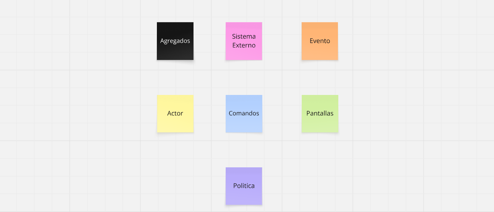

1. Unstructured Exploration
   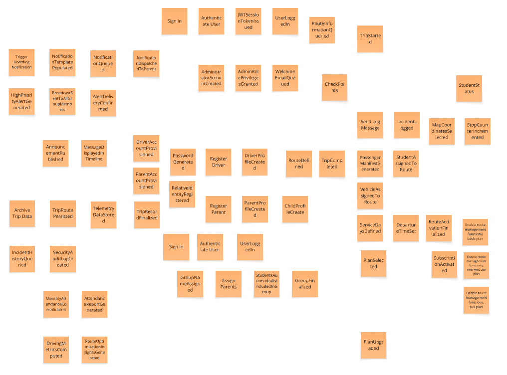

En esta fase inicial, identificamos los eventos de dominio fundamentales para la movilidad escolar. El objetivo es capturar los hitos de negocio que permiten la interacción segura entre padres, conductores y administradores sin priorizar aún la cronología. Los eventos se organizan en seis ejes principales:

- Identidad y Gestión de Accesos (IAM): Maneja la seguridad y autenticación de la plataforma. Incluye eventos como el inicio de sesión (Login), autenticación de usuarios (Authenticate User), emisión de tokens JWT para sesiones seguras y el registro de administradores.

- Gestión de Suscripciones y Planes: Controla el acceso comercial a las funcionalidades de la plataforma. Abarca la selección de planes, el procesamiento de pagos a través de pasarelas externas y la activación de funciones de gestión de rutas según el plan elegido (básico, intermedio o completo).

- Gestión de Stakeholders y Activos: Administra los perfiles de los actores involucrados y sus relaciones. Incluye el registro de conductores, padres y estudiantes, así como la creación de grupos y la vinculación de hijos a sus respectivos padres para el seguimiento personalizado.

- Planificación de Flota y Rutas: Define la logística previa al viaje. Comprende la creación de geocercas para las rutas (RouteGeofenceCreated), la selección de puntos de parada (Pick Waypoints), la asignación de estudiantes a vehículos y la definición de horarios de salida.

- Ejecución y Monitoreo de Viajes: Es el núcleo operativo en tiempo real. Captura el inicio del trayecto por el conductor (TripStarted), el registro del estado de abordaje de cada estudiante (StudentStatus) y la consulta activa de la información de la ruta durante el recorrido.

2. Timelines
   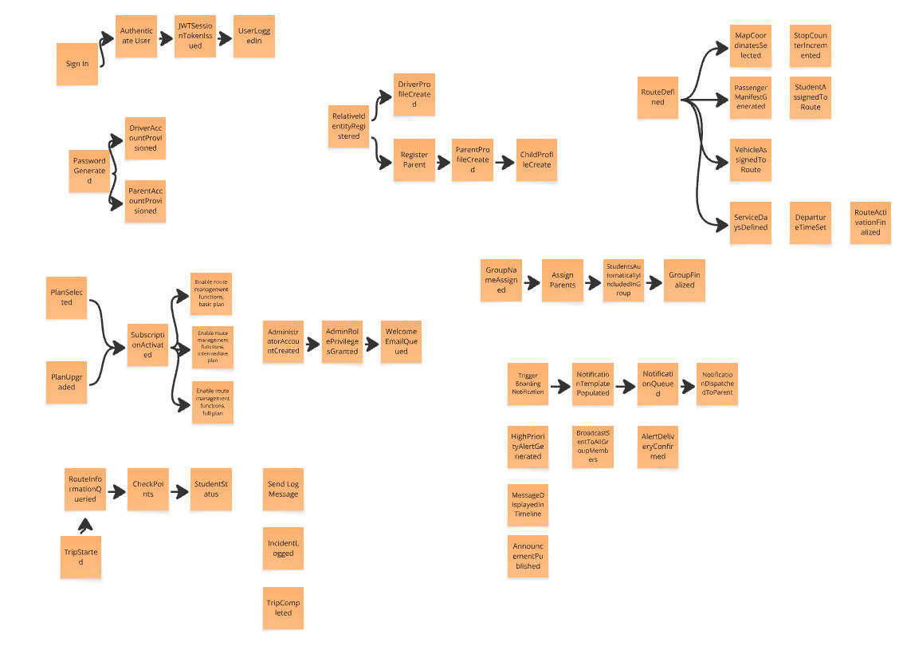

En este paso, los eventos se organizan en secuencias cronológicas para comprender el flujo natural de los procesos de negocio. Las líneas de tiempo clave incluyen:

- Flujo de Incorporación y Suscripción: Registro de administrador → Creación de organización → Selección de plan de suscripción → Procesamiento de pago → Activación de cuotas de servicios.

- Gestión de Stakeholders y Activos: Registro de conductores y padres → Vinculación de estudiante a padre → Creación de grupos de transporte → Registro de vehículos → Asignación de conductor a vehículo.

- Planificación de Rutas Institucionales: Definición de geocerca de la ruta → Selección de puntos de parada (waypoints) → Asignación de estudiantes a la ruta → Establecimiento de horarios de salida → Finalización de la activación de ruta.

- Ejecución de Viajes y Monitoreo: Inicio de viaje por el conductor → Consulta de información de ruta → Registro de abordaje del estudiante → Notificación automática al padre → Seguimiento de progreso en tiempo real.

- Gestión de Comunicaciones e Incidentes: Detección de anomalía → Generación de alerta de pánico de alta prioridad → Despacho de alerta a administradores/padres → Difusión de mensajes de estado (broadcast) → Visualización en línea de tiempo.

- Cierre de Operación: Llegada al destino final → Confirmación de descenso total de estudiantes → Finalización de viaje → Archivamiento de datos de ejecución → Liberación de recursos de flota.

Estas líneas de tiempo revelan las dependencias temporales y la naturaleza secuencial de las operaciones dentro del sistema, asegurando que el flujo de información viaje correctamente desde la base de datos hasta las notificaciones en el dispositivo del padre.

3. Pain Points
   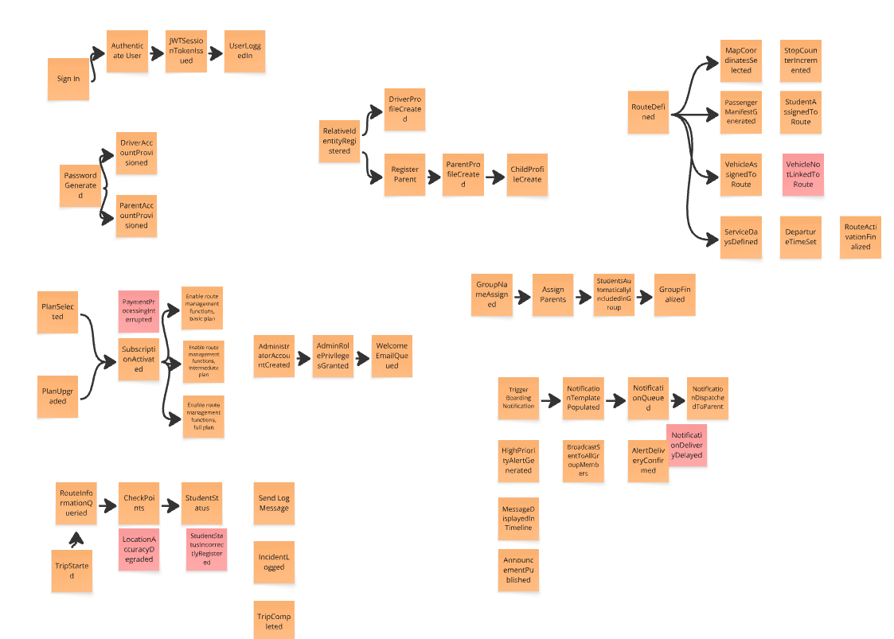

En esta etapa, se identifican las situaiciones en las que se generan los puntos de fricción, cuellos de botella y ciertos problemas que surgen durante los procesos operativos y administrativos. Los pain points detectados incluyen:

- Sincronización de Notificaciones: Retrasos en la entrega de alertas push al padre cuando el estudiante aborda el vehículo, generando incertidumbre innecesaria.

- Gestión de Errores en Abordaje: Fallos manuales del conductor al registrar el estado del estudiante (StudentStatus), lo que puede resultar en registros de asistencia incorrectos.

- Validaciones de Seguridad: Bloqueos o fallos en la generación de alertas de pánico de alta prioridad durante emergencias debido a pérdida de conectividad o errores del sistema.

- Asignación de Recursos: Errores en la vinculación manual de conductores a vehículos o rutas, impidiendo el inicio correcto del viaje en la plataforma.

- Fricción en el Pago y Suscripción: Interrupciones en el procesamiento de pagos que inhabilitan las cuotas de rutas y bloquean la operación diaria de la institución.

- Precisión de Geolocalización: Problemas de precisión en el GPS que confunden la ubicacion de checkpoints.

Identificar estos puntos críticos permite al equipo de SafeRoute priorizar el desarrollo de mecanismos de redundancia y mejorar la experiencia de usuario, asegurando que la comunicación entre el transporte y el hogar sea infalible.

4. Pivotal Points
   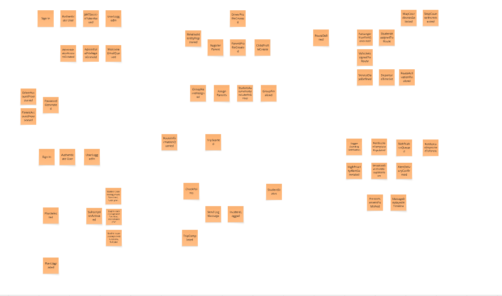

Los puntos pivotales son eventos determinantes que marcan transiciones críticas en el ciclo de vida del servicio. Estos incluyen:

Activación de Suscripción: Este hito marca la transición de un estado de configuración restringida a uno operativo, habilitando las cuotas de rutas y conductores necesarias para funcionar.

Finalización de Definición de Ruta: Es el punto donde la planificación técnica termina y la ruta queda lista para ser asignada a un vehículo y un conductor.

Inicio de Viaje: Este evento activa el monitoreo en tiempo real y permite que los padres comiencen a visualizar el progreso del transporte en sus aplicaciones.

Registro de Abordaje (Student Boarded): Es el evento pivotal de comunicación; confirma la seguridad del estudiante y dispara automáticamente la notificación push hacia el tutor legal.

Generación de Alerta de Pánico: Cambia el estado del viaje de "Normal" a "Emergencia", activando protocolos de respuesta inmediata y priorizando la comunicación de red de seguridad.

Completación de Viaje: Marca el fin de la responsabilidad operativa del conductor sobre los estudiantes y archiva el registro para liberar los recursos de la flota.

Estos puntos son determinantes para la continuidad y el éxito de la movilidad escolar, ya que aseguran que cada fase del proceso se cumpla antes de pasar a la siguiente.

5. Commands
   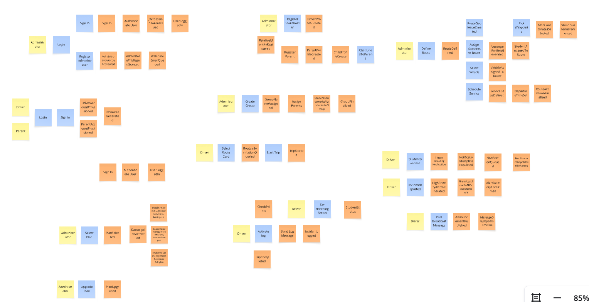

Los comandos representan las acciones o intenciones de los usuarios que desencadenan eventos en el sistema. Los principales comandos identificados son:

- Gestión de Identidad y Acceso (IAM): Registrar administrador, iniciar sesión, autenticar usuario, asignar rol, revocar privilegios.

- Gestión de Suscripciones y Planes: Seleccionar plan, iniciar proceso de pago, activar funciones de gestión, actualizar cuotas de conductores, cancelar servicio.

- Gestión de Stakeholders y Activos: Registrar conductor, registrar padre, vincular estudiante a pariente, registrar vehículo, crear grupo de transporte, asignar miembros al grupo.

- Gestión de Flota y Rutas: Definir geocerca, seleccionar puntos de parada (waypoints), asignar estudiantes a ruta, asignar vehículo a ruta, establecer horario de salida, finalizar activación de ruta.

- Ejecución de Viajes y Monitoreo: Iniciar viaje, consultar información de ruta, registrar estado de abordaje del estudiante, reportar incidente (botón de pánico), finalizar viaje.

- Comunicación y Notificaciones: Preparar notificación push, despachar alerta a padres, publicar mensaje de difusión (broadcast), mostrar mensaje en línea de tiempo.

6. Policies
   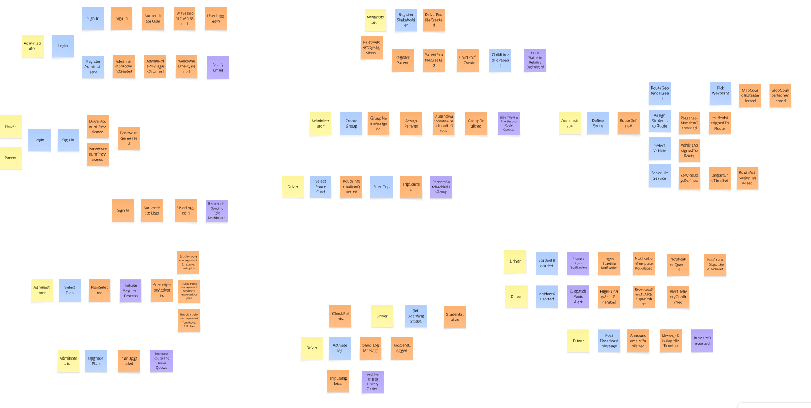

Las políticas automatizan la lógica de negocio y aseguran la coherencia del sistema ante eventos críticos. Las políticas clave incluyen:

- Cuando el pago es exitoso → Activar suscripción y habilitar cuotas de rutas/conductores automáticamente.

- Cuando el conductor inicia un viaje → Notificar a todos los padres vinculados a esa ruta sobre el inicio del monitoreo en tiempo real.

- Cuando se registra el abordaje del estudiante → Despachar notificación push inmediata al dispositivo del padre correspondiente.

- Cuando se reporta un incidente (pánico) → Generar alerta de alta prioridad y transmitirla instantáneamente a los administradores y padres del grupo.

- Cuando se publica un mensaje de difusión → Mostrar el mensaje en la línea de tiempo de todos los miembros del grupo seleccionado.

- Cuando se confirma el descenso total de estudiantes → Marcar el viaje como completado y archivar los datos de ejecución.

- Cuando falla el registro de un stakeholder → Enviar una notificación de error con los detalles de validación al administrador.

7. Read Models
   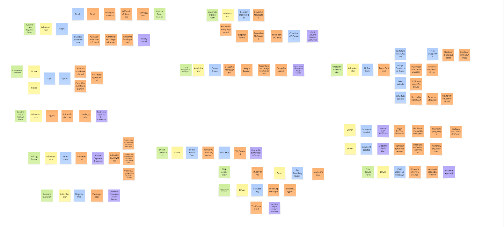

Los principales modelos de lectura identificados para garantizar la visibilidad del sistema son:

- Dashboard del Conductor: Vista detallada de la ruta asignada, lista de estudiantes por recoger, puntos de parada (waypoints) y estado de abordaje en tiempo real.

- Panel de Monitoreo para Padres: Visualización en tiempo real de la ubicación del vehículo, estado de seguridad del estudiante y línea de tiempo de eventos del viaje.

- Vista de Gestión de Grupos: Listado de estudiantes agrupados por ruta, vinculación con sus respectivos padres y estado de asistencia mensual.

- Estado de la Flota: Registro de vehículos activos, conductores asignados a cada unidad y disponibilidad de recursos para nuevas rutas.

- Historial de Incidentes: Registro cronológico de alertas de pánico, mensajes de difusión enviados y resoluciones de eventos de seguridad.

- Panel de Suscripción y Cuotas: Información sobre el plan activo, estado de los pagos y uso de las cuotas de rutas y conductores contratados.

- Directorio de Stakeholders: Lista completa de perfiles de usuarios (padres, conductores y administradores) con sus respectivos roles y privilegios de acceso.

8. External Systems
   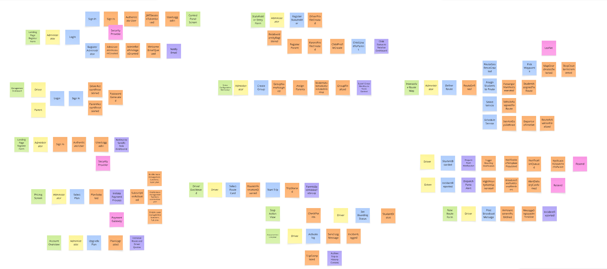

Las integraciones identificadas para la solución incluyen:

- Leaflet (Proveedor de Mapas): Se encarga de la visualización interactiva de las rutas, el trazado de geocercas (geofencing) y la gestión de coordenadas geográficas para el monitoreo en tiempo real.

- Resend (Servicio de Email): Utilizado para el envío de notificaciones transaccionales y correos electrónicos automáticos, como mensajes de bienvenida, confirmaciones de registro y alertas administrativas.

- PayPal (Pasarela de Pago): Servicio encargado de procesar de forma segura las transacciones financieras para la activación, renovación y actualización de los planes de suscripción institucional.

- MySQL (Gestión de Base de Datos): Actúa como el sistema externo de persistencia relacional encargado de almacenar y organizar toda la estructura de usuarios, rutas, vehículos y registros operativos.

9. Aggregates
   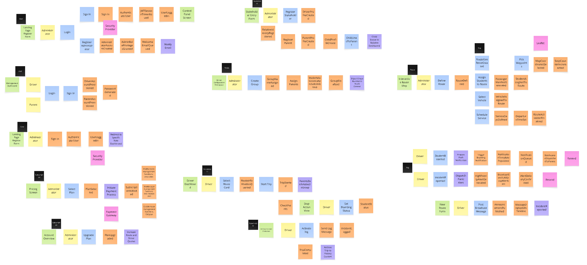

Basado en los dominios operativos identificados, los agregados son:

User (Raíz): Gestiona la identidad del usuario, incluyendo credenciales de autenticación, roles asignados (Administrador, Padre, Conductor) y privilegios de acceso al panel de control.

Organization (Raíz): Controla la configuración de la institución, la gestión de miembros y la vinculación de la cuenta con los parámetros base del sistema institucional.

Subscription (Raíz): Administra el ciclo de vida del plan de servicios, integrando el procesamiento de pagos a través de PayPal para habilitar o restringir las cuotas de rutas y conductores disponibles.

Stakeholder (Raíz): Encapsula la información de padres y conductores, gestionando la vinculación crítica entre el tutor (padre) y el estudiante para asegurar el flujo de notificaciones.

Vehicle (Raíz): Maneja el registro de las unidades de transporte, sus especificaciones técnicas y los cambios de estado (activo/inactivo) dentro de la flota.

Route (Raíz): Coordina la definición logística del recorrido, incluyendo la creación de geocercas, la selección de paraderos (waypoints) y la asignación previa de estudiantes a la ruta.

Trip (Raíz): Controla la ejecución operativa en tiempo real, registrando el inicio del trayecto, los cambios en el estado de abordaje de los estudiantes y el log de incidentes generados durante el viaje.

10. Bounded Contexts
    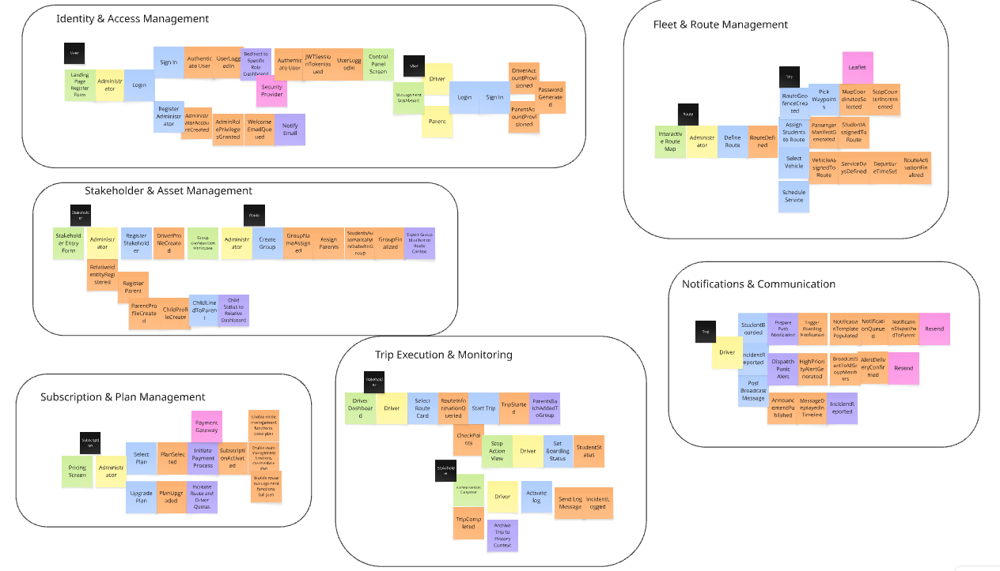

Los contextos delimitados organizan los agregados en dominios de negocio independientes, permitiendo que cada uno evolucione de manera autónoma para facilitar la escalabilidad del sistema:

- Identity & Access Management: Este contexto gestiona la seguridad perimetral, incluyendo la autenticación de usuarios, la creación de organizaciones, y la asignación de roles y privilegios para administradores, padres y conductores. Agregados: User, Organization.

- Subscription & Plan Management: Administra el ciclo de vida comercial del servicio. Se encarga de la selección de planes, el procesamiento de pagos mediante la integración con PayPal y la activación de las cuotas operativas de rutas y conductores contratados. Agregados: Subscription.

- Stakeholder & Asset Management: Maneja los perfiles de los actores críticos y los recursos físicos de la institución. Incluye el registro de conductores y padres, la vinculación esencial entre padres e hijos (estudiantes), y la gestión de la flota de vehículos. Agregados: Stakeholder, Vehicle.

- Route Planning & Execution: Coordina la logística integral, desde la planificación técnica hasta la operación en tiempo real. Cubre la definición de geocercas, la selección de paraderos, el monitoreo del abordaje de estudiantes y la gestión de incidentes durante el trayecto. Agregados: Route, Trip.

- Notifications & Communication: Actúa como el eje de interacción inmediata entre el transporte y el hogar. Orquesta el envío de notificaciones push (como el estado de abordaje del estudiante), alertas de pánico y mensajes de difusión general para mantener informados a los padres y administradores.

#### 4.6.2. Software Architecture Context Diagram

El diagrama de contexto presenta a SafeRoute como el sistema central, rodeado por sus tres tipos de usuarios y los sistemas externos con los que interactúa. El Administrador gestiona la plataforma configurando rutas, registrando actores y administrando suscripciones. El Conductor accede para ejecutar viajes, registrar el abordaje de estudiantes y emitir alertas de pánico. El Padre/Tutor monitorea en tiempo real el estado de la ruta de su hijo y recibe notificaciones. SafeRoute se integra con PayPal para el procesamiento de pagos, Leaflet + OpenRouteService para la visualización de mapas y cálculo de rutas escolares, y Resend como proveedor de correo transaccional para el despacho de alertas y notificaciones.

#### 4.6.3. Software Architecture Container Diagrams

Aquí se detallan las unidades de despliegue principales del sistema. El diagrama muestra cómo SafeRoute se divide en una Landing Page estática (HTML5, CSS3, JavaScript), una aplicación web interactiva en el cliente desarrollada en Angular con Angular Material, una API backend modularizada construida con Spring Boot y Java, un Shared Kernel como librería Java de tipos compartidos entre contextos, y un repositorio persistente central en MySQL.

#### 4.6.4. Software Architecture Components Diagrams

Este diagrama ofrece la visión macro del backend. Demuestra cómo el monolito de Spring Boot está organizado lógicamente en seis Bounded Contexts independientes y un Shared Kernel (núcleo compartido de Value Objects), asegurando una separación clara de responsabilidades a nivel de dominio.

- Identity & Access Management:
  Desglosa el módulo de identidad en su arquitectura interna de 4 capas (API, Application, Domain, Infrastructure). Ilustra cómo se maneja la autenticación de usuarios, la provisión de cuentas y la asignación de roles de forma aislada, con Spring Security gestionando la emisión de tokens JWT en la capa de infraestructura.
  

- Subscription & Plan Management:
  Muestra la estructura interna de 4 capas del contexto encargado de la monetización. Detalla el flujo desde el controlador REST hasta la infraestructura que se integra con PayPal para gestionar el ciclo de vida de los planes y pagos de suscripción.
  

- Stakeholder & Asset Management:
  Representa las capas internas del dominio que administra la información core del negocio: la creación y vinculación de perfiles para conductores, padres de familia, estudiantes y la gestión de la flota de vehículos disponibles por organización.
  

- Route Planning & Execution:
  Detalla la arquitectura modular (Controller, Service, Domain, Repository) encargada de la logística previa al viaje. Maneja la definición de paraderos con coordenadas GPS de alta precisión, la asignación de vehículos y conductores, y la configuración de horarios y días de servicio por ruta.
  

- Notifications & Communication:
  Describe el módulo dedicado a la comunicación asíncrona en sus 4 capas. Orquesta la recepción de eventos internos emitidos por el contexto de Trip y utiliza su capa de infraestructura para despachar alertas de pánico, notificaciones de abordaje y comunicados de difusión general mediante el proveedor externo Resend.
  

- Trip Execution & Monitoring:
  Ilustra el núcleo operativo del sistema en sus 4 capas. Muestra cómo se procesa la lógica en tiempo real durante la ejecución del viaje, gestionando el registro de abordajes por estudiante, el log de incidentes y la emisión de eventos de dominio internos que activan el contexto de Notificaciones.
  

- Shared Kernel:
  Este diagrama expone las 4 capas transversales (Building Blocks) que fundamentan la arquitectura limpia del monolito. Detalla cómo se proveen clases base y utilidades compartidas: Middlewares en la capa API, interfaces y DTOs base en Application, Value Objects globales (TripId, StudentId) en Domain, y repositorios genéricos en Infrastructure, evitando la duplicidad de código en el resto de los Bounded Contexts.
  

#### 4.7.1. Class Diagrams

**BackEnd**

- Identity and Access Management:

Gestiona organizaciones, usuarios y roles en el entorno de la aplicación.
Organization (AggregateRoot): Maneja el ciclo de vida de la institución (métodos create(), suspend(), activate()). Se relaciona mediante Value Objects para su identificador, nombre y estado.
User (AggregateRoot): Gestiona la autenticación y la asignación de roles de los usuarios (métodos register(), authenticate(), changeRole()). Pertenece a una organización a través del OrganizationId compartido y utiliza Value Objects de seguridad como PasswordHash.
Role (Entity): Define los niveles de acceso dentro del sistema usando el Value Object

- Subscription & Plan Management:

Controla el modelo de negocio, definiendo los planes y suscripciones de cada organización.
Subscription (AggregateRoot): Controla el estado y la vigencia de una suscripción (métodos activate(), upgrade(), cancel()). Se vincula directamente a una organización y a un plan específico mediante sus identificadores.
Plan (AggregateRoot): Establece los límites operativos y económicos mediante los Value Objects RouteQuota y DriverQuota, los cuales validan que no se exceda la capacidad contratada de rutas y conductores.

- Stakeholder & Asset Management:

Modela a los actores humanos y sus agrupaciones dentro del sistema.
Parent (AggregateRoot): Representa a los apoderados e incluye una lista de entidades Child, gestionando la adición o remoción de hijos.
Driver (Entity): Define a los conductores, agregando atributos específicos de su labor como el Value Object LicenseNumber.
Child (Entity): Representa a los estudiantes, gestionando su estado de inscripción mediante el Value Object ChildEnrollmentState.
StudentGroup (Entity): Permite agrupar referencias a múltiples niños (ChildId) para facilitar su asignación.

- Fleet & Route Planning:

Encargado de la planificación logística y operativa del transporte.
Route (AggregateRoot): Define el recorrido y su programación utilizando Value Objects como DepartureTime y ServiceDays. Compone una secuencia de paradas (Stop) y se asocia a un vehículo y a una asignación específica.
Stop, Vehicle y Assignment (Entities): Stop maneja las coordenadas exactas y el orden de recojo. Vehicle controla la capacidad y disponibilidad de la unidad. Assignment vincula operativamente a un conductor con un grupo específico de niños para esa ruta.

- Trip Execution & Monitoring:

Trip (AggregateRoot): Controla el ciclo de vida del recorrido (métodos start(), complete()) vinculando una ruta, un conductor y una organización.
Attendance (Entity): Registra individualmente si un niño abordó o no, utilizando el Value Object BoardingState (boarded, missing, omitted).
Incident (Entity): Permite reportar cualquier problema durante el viaje, encapsulando los detalles en el Value Object IncidentDescription.

- Notifications & Communication:

Centraliza el envío de información y alertas hacia los padres de familia.
Notification (AggregateRoot): Organiza el envío de mensajes, gestionando la categoría y el estado de entrega (NotificationDeliveryState) hacia un apoderado en el contexto de un viaje específico.
Alert y Announcement (Entities): Alert se enfoca en notificaciones inmediatas o de pánico basadas en el tiempo de disparo (triggeredAt). Announcement maneja comunicados generales asociados a una ruta específica.

- Shared:

Actúa como el Shared Kernel transversal de toda la solución en Spring Boot.

Contiene exclusivamente Value Objects inmutables que sirven como identificadores globales (ej. OrganizationId, RouteId, ChildId) y conceptos comunes como FullName y Coordinates. Esto asegura la consistencia de los tipos de datos en la comunicación entre los distintos Bounded Contexts.

**FrontEnd**

En todos los diagramas, el componente raíz App actúa como contenedor principal: tiene composición (composes) con los componentes de cada bounded context. El manejo del estado se realiza mediante clases *Store (usando Signal<T>) , las cuales se comunican con clases *Api para las peticiones HTTP. Las clases *Assembler transforman los recursos (*Resource) de la API en modelos de dominio puro.

- Identity and Access Management:

Gestiona la autenticación de usuarios y la configuración de la organización.

Presentation & Domain: App compone formularios de inicio de sesión (AdminLoginForm, UserLoginForm), registro (AdminRegisterForm) y gestión de organización (OrganizationForm, OrganizationProfile). Estos componentes interactúan con IamStore y consumen directamente los modelos de dominio puros (User, Organization) para reflejar y gestionar los datos de la sesión actual en la interfaz.

Application & Infrastructure: IamStore centraliza el estado con currentUserSignal y organizationSignal. Utiliza IamApi para operaciones como signIn() o createOrganization(), y UserAssembler/OrganizationAssembler para mapear las respuestas de la API (UserResource, OrganizationResource) a los modelos del dominio.

- Subscription & Plan Management:

Maneja la visualización y selección de planes para la organización.

Presentation & Domain: App compone PlanSelector (para elegir un plan) y SubscriptionStatus. Estos componentes utilizan directamente los modelos de dominio (Subscription y Plan) como inputs para renderizar la información de negocio (como los días restantes o límites de cuota) en la UI sin depender de estructuras externas.

Application & Infrastructure: SubscriptionStore maneja subscriptionSignal y plansSignal. Se comunica con SubscriptionApi para cargar planes (getAllPlans()) o modificar la suscripción (upgradeSubscription(), cancelSubscription()), usando sus respectivos Assemblers.

- Stakeholder & Asset Management:

Controla las vistas de listado y gestión de los actores del sistema.

Presentation & Domain: App compone componentes de lista (ParentList, DriverList, ChildList, StudentGroupList) que permiten filtrar (searchQuery), seleccionar y eliminar registros utilizando los modelos del dominio (Parent, Driver, Child, StudentGroup) como la fuente de verdad para la visualización unificada de los actores.

Application & Infrastructure: StakeholderStore maneja el estado de estas listas mediante Signals. StakeholderApi ejecuta operaciones CRUD hacia el backend, y las respuestas (ej. ParentResource) son transformadas a modelos de dominio mediante clases como ParentAssembler.

- Fleet & Route Planning:

Interfaz para armar la logística de rutas, vehículos y asignaciones.

Presentation & Domain: App compone RouteForm (creación de rutas), StopList (gestión de paradas), VehicleList (visualización de vehículos) y AssignmentForm (asignación de conductores y niños). La interfaz gráfica se alimenta estrictamente de las entidades del dominio (Route, Stop, Vehicle, Assignment) para garantizar que la vista esté alineada con las reglas del negocio logístico.

Application & Infrastructure: FleetStore orquesta el estado de rutas, paradas, vehículos y asignaciones. FleetApi maneja las peticiones HTTP y usa Assemblers para convertir, por ejemplo, RouteResource en la entidad del dominio Route.

- Trip Execution & Monitoring:

Pantallas operativas para el control en tiempo real de los viajes.

Presentation & Domain: App compone TripDashboard (controla inicio y fin del viaje), AttendanceChecklist (gestiona el estado de abordaje de cada niño) e IncidentForm (permite reportar incidentes). Estos componentes consumen los modelos centrales del dominio (Trip, Attendance, Incident) para reflejar de forma fidedigna el estado real de la operación.

Application & Infrastructure: TripStore centraliza el viaje actual, las asistencias y los incidentes. Delega las acciones a TripApi (ej. startTrip(), updateBoardingStatus()), apoyándose en TripAssembler, AttendanceAssembler e IncidentAssembler.

- Notifications & Communication:

Centraliza la visualización y envío de notificaciones y alertas.

Presentation & Domain: App compone NotificationList (para filtrar y marcar notificaciones como leídas), AlertPanel (gestiona alertas activas y pánico) y AnnouncementForm (creación de comunicados). Las vistas dependen exclusivamente de los modelos de dominio (Notification, Alert, Announcement) para renderizar los mensajes y alertas operativas a los usuarios finales.

Application & Infrastructure: NotificationsStore maneja el estado de notificaciones, alertas y anuncios. NotificationsApi realiza las peticiones (ej. dispatchNotification(), triggerAlert()) y los Assemblers transforman los recursos recibidos en modelos limpios del dominio.
### 4.8. Database Design

**- Identity & Access Management**

Este bounded context gestiona la seguridad perimetral del sistema. La tabla `organizations` actúa como raíz estructural, siendo referenciada por prácticamente todos los demás contextos. `users` centraliza las credenciales de autenticación (`email` UNIQUE, `password_hash`) y se vincula a `organizations` y `roles` mediante FK. `roles` es una tabla de catálogo con clave `INT` que define los niveles de acceso disponibles: administrador, conductor y padre de familia.

**Tabla: organizations**
| Atributo | Tipo |
|------------|--------------|
| id | CHAR(36) (PK)|
| name | VARCHAR(100) |
| status | VARCHAR(20) |
| created_at | DATETIME |

**Métodos**
| Método | Descripción |
|---------------|--------------------------------------|
| Create() | Crea una nueva organización. |
| Activate() | Activa la organización. |
| Suspend() | Suspende la organización. |
| IsActive() | Verifica si la organización está activa. |

---

**Tabla: roles**
| Atributo | Tipo |
|----------|-------------|
| id | INT (PK) |
| name | VARCHAR(20) |

**Métodos**
| Método | Descripción |
|----------------|------------------------------------|
| GetRoleName() | Retorna el nombre del rol. |
| IsAdmin() | Verifica si el rol es administrador.|
| IsDriver() | Verifica si el rol es conductor. |
| IsParent() | Verifica si el rol es padre. |

---

**Tabla: users**
| Atributo | Tipo |
|-----------------|--------------|
| id | CHAR(36) (PK)|
| organization_id | CHAR(36) (FK)|
| role_id | INT (FK) |
| first_name | VARCHAR(100) |
| last_name | VARCHAR(100) |
| email | VARCHAR(255) |
| password_hash | VARCHAR(255) |
| created_at | DATETIME |

**Métodos**
| Método | Descripción |
|-----------------------------|------------------------------------------|
| Register() | Registra un nuevo usuario. |
| Authenticate(password) | Autentica al usuario con su contraseña. |
| ChangeRole(role) | Cambia el rol asignado al usuario. |
| GetEmail() | Retorna el email del usuario. |

---

**- Subscription & Plan Management**

Este bounded context administra el ciclo de vida comercial del servicio. La tabla `plans` es un catálogo que define los tiers disponibles y sus cuotas operativas. La tabla `subscriptions` vincula una organización a un plan y registra su estado, fecha de inicio y fecha de fin nullable, ya que una suscripción activa no tiene fecha de término definida.

**Tabla: plans**
| Atributo | Tipo |
|-------------|---------------|
| id | INT (PK) |
| plan_tier | VARCHAR(20) |
| max_routes | INT |
| max_drivers | INT |
| price | DECIMAL(10,2) |

**Métodos**
| Método | Descripción |
|---------------------------|----------------------------------------------|
| GetPlanName() | Retorna el nombre del tier del plan. |
| GetRouteLimit() | Retorna el límite de rutas del plan. |
| IsWithinRouteQuota(n) | Verifica si el valor está dentro de la cuota de rutas. |
| IsWithinDriverQuota(n) | Verifica si el valor está dentro de la cuota de conductores. |

---

**Tabla: subscriptions**
| Atributo | Tipo |
|-----------------|-------------|
| id | CHAR(36) (PK)|
| organization_id | CHAR(36) (FK)|
| plan_id | INT (FK) |
| state | VARCHAR(20) |
| start_date | DATETIME |
| end_date | DATETIME |

**Métodos**
| Método | Descripción |
|-------------------|----------------------------------------------|
| Activate() | Activa la suscripción. |
| Upgrade(planId) | Cambia el plan de la suscripción. |
| Cancel() | Cancela la suscripción. |
| GetRemainingDays()| Retorna los días restantes de la suscripción.|

---

**- Stakeholder & Asset Management**

Este bounded context maneja los perfiles de los actores críticos y los recursos físicos de la institución. Las tablas `parents` y `drivers` referencian tanto `organization_id` como `user_id` (FK hacia IAM), separando los datos de perfil de las credenciales de acceso. `children` pertenece exclusivamente a un padre mediante `parent_id` FK. `student_groups` agrupa referencias lógicas a hijos mediante la tabla de unión `student_group_children`. `vehicles` registra la flota de transporte disponible por organización.

**Tabla: parents**
| Atributo | Tipo |
|-----------------|--------------|
| id | CHAR(36) (PK)|
| organization_id | CHAR(36) (FK)|
| user_id | CHAR(36) (FK)|
| first_name | VARCHAR(100) |
| last_name | VARCHAR(100) |
| email | VARCHAR(255) |
| phone_number | VARCHAR(20) |

**Métodos**
| Método | Descripción |
|-------------------------|------------------------------------------|
| AddChild(child) | Agrega un hijo al padre. |
| RemoveChild(childId) | Elimina un hijo del padre. |
| GetChildren() | Retorna la lista de hijos del padre. |
| GetEmail() | Retorna el email del padre. |

---

**Tabla: drivers**
| Atributo | Tipo |
|-----------------|--------------|
| id | CHAR(36) (PK)|
| organization_id | CHAR(36) (FK)|
| user_id | CHAR(36) (FK)|
| first_name | VARCHAR(100) |
| last_name | VARCHAR(100) |
| email | VARCHAR(255) |
| phone_number | VARCHAR(20) |
| license_number | VARCHAR(50) |

**Métodos**
| Método | Descripción |
|------------------------------|---------------------------------------------|
| IsAvailable() | Verifica si el conductor está disponible. |
| GetLicenseNumber() | Retorna el número de licencia. |
| UpdatePhoneNumber(phone) | Actualiza el número de teléfono. |
| GetFullName() | Retorna el nombre completo del conductor. |

---

**Tabla: children**
| Atributo | Tipo |
|------------------|--------------|
| id | CHAR(36) (PK)|
| parent_id | CHAR(36) (FK)|
| first_name | VARCHAR(100) |
| last_name | VARCHAR(100) |
| age | INT |
| enrollment_state | VARCHAR(20) |

**Métodos**
| Método | Descripción |
|----------------|------------------------------------------------|
| Enroll() | Matricula al estudiante en el servicio. |
| Unenroll() | Retira la matrícula del estudiante. |
| IsEnrolled() | Verifica si el estudiante está matriculado. |
| GetFullName() | Retorna el nombre completo del estudiante. |

---

**Tabla: student_groups**
| Atributo | Tipo |
|-----------------|--------------|
| id | CHAR(36) (PK)|
| organization_id | CHAR(36) (FK)|
| name | VARCHAR(100) |
| is_finalized | BOOLEAN |

**Métodos**
| Método | Descripción |
|---------------------|-----------------------------------------------|
| AddChild(childId) | Agrega un estudiante al grupo. |
| RemoveChild(childId)| Elimina un estudiante del grupo. |
| Finalize() | Marca el grupo como finalizado. |
| GetChildCount() | Retorna la cantidad de estudiantes del grupo. |

---

**Tabla: student_group_children**
| Atributo | Tipo |
|------------------|--------------|
| student_group_id | CHAR(36) (FK)|
| child_id | CHAR(36) (FK)|

**Métodos**
| Método | Descripción |
|------------------|----------------------------------------------------|
| AssignChild() | Asocia un estudiante a un grupo. |
| RemoveChild() | Desvincula un estudiante de un grupo. |

---

**Tabla: vehicles**
| Atributo | Tipo |
|-----------------|--------------|
| id | CHAR(36) (PK)|
| organization_id | CHAR(36) (FK)|
| plate | VARCHAR(20) |
| model | VARCHAR(100) |
| brand | VARCHAR(100) |
| capacity | INT |

**Métodos**
| Método | Descripción |
|-------------------------------|------------------------------------------|
| IsAvailable() | Verifica si el vehículo está disponible. |
| GetPlate() | Retorna la placa del vehículo. |
| GetCapacity() | Retorna la capacidad del vehículo. |
| UpdateDetails(model, brand) | Actualiza los datos del vehículo. |

---

**- Route Planning & Execution**

Este bounded context coordina la planificación técnica de las rutas de transporte escolar. La tabla `routes` define cada ruta con su vehículo asignado, horario de salida y días de servicio. `stops` almacena los paraderos georreferenciados con coordenadas de alta precisión y orden de parada. `assignments` vincula una ruta con un conductor en cardinalidad 1:1, y `assignment_children` resuelve la relación muchos a muchos entre asignaciones y estudiantes.

**Tabla: routes**
| Atributo | Tipo |
|-----------------|--------------|
| id | CHAR(36) (PK)|
| organization_id | CHAR(36) (FK)|
| vehicle_id | CHAR(36) (FK)|
| name | VARCHAR(100) |
| route_state | VARCHAR(20) |
| departure_time | TIME |
| service_days | VARCHAR(100) |

**Métodos**
| Método | Descripción |
|---------------------|----------------------------------------------|
| Activate() | Activa la ruta para operación. |
| Deactivate() | Desactiva la ruta. |
| AddStop(stop) | Agrega un paradero a la ruta. |
| GetStopSequence() | Retorna la secuencia ordenada de paraderos. |

---

**Tabla: stops**
| Atributo | Tipo |
|------------|---------------|
| id | CHAR(36) (PK) |
| route_id | CHAR(36) (FK) |
| name | VARCHAR(100) |
| latitude | DECIMAL(10,8) |
| longitude | DECIMAL(11,8) |
| stop_order | INT |

**Métodos**
| Método | Descripción |
|------------------------------|----------------------------------------------|
| IsFirst() | Verifica si es el primer paradero. |
| IsLast() | Verifica si es el último paradero. |
| UpdateCoordinates(coords) | Actualiza las coordenadas del paradero. |
| GetPosition() | Retorna la posición del paradero en la ruta. |

---

**Tabla: assignments**
| Atributo | Tipo |
|-----------|--------------|
| id | CHAR(36) (PK)|
| route_id | CHAR(36) (FK)|
| driver_id | CHAR(36) (FK)|

**Métodos**
| Método | Descripción |
|-------------------------|-----------------------------------------------|
| AssignDriver(driverId) | Asigna un conductor a la ruta. |
| AssignChild(childId) | Agrega un estudiante a la asignación. |
| RemoveChild(childId) | Elimina un estudiante de la asignación. |
| GetChildCount() | Retorna la cantidad de estudiantes asignados. |

---

**Tabla: assignment_children**
| Atributo | Tipo |
|---------------|--------------|
| assignment_id | CHAR(36) (FK)|
| child_id | CHAR(36) (FK)|

**Métodos**
| Método | Descripción |
|----------------|------------------------------------------------------|
| AssignChild() | Asocia un estudiante a una asignación de ruta. |
| RemoveChild() | Desvincula un estudiante de una asignación de ruta. |

---

**- Trip Execution & Monitoring**

Este bounded context es el núcleo operativo del servicio. La tabla `trips` registra cada ejecución real de una ruta, con `start_time` y `end_time` nullable dado que el viaje puede estar en curso. `attendances` captura el estado de abordaje de cada estudiante por viaje, con `boarded_at` nullable para casos de ausencia. `incidents` referencia tanto `trip_id` como `route_id`, permitiendo trazabilidad del evento al viaje específico y a la ruta afectada.

**Tabla: trips**
| Atributo | Tipo |
|-----------------|--------------|
| id | CHAR(36) (PK)|
| organization_id | CHAR(36) (FK)|
| route_id | CHAR(36) (FK)|
| driver_id | CHAR(36) (FK)|
| trip_state | VARCHAR(20) |
| start_time | DATETIME |
| end_time | DATETIME |

**Métodos**
| Método | Descripción |
|---------------------------------|---------------------------------------------------|
| Start() | Inicia el viaje. |
| Complete() | Completa el viaje. |
| RecordBoarding(childId, state) | Registra el estado de abordaje de un estudiante. |
| IsInProgress() | Verifica si el viaje está en curso. |

---

**Tabla: attendances**
| Atributo | Tipo |
|----------------|--------------|
| id | CHAR(36) (PK)|
| trip_id | CHAR(36) (FK)|
| child_id | CHAR(36) (FK)|
| boarding_state | VARCHAR(20) |
| boarded_at | DATETIME |

**Métodos**
| Método | Descripción |
|------------------------------|-------------------------------------------------|
| UpdateBoardingState(state) | Actualiza el estado de abordaje del estudiante. |
| IsBoarded() | Verifica si el estudiante abordó. |
| GetBoardingTime() | Retorna la hora de abordaje. |

---

**Tabla: incidents**
| Atributo | Tipo |
|-------------|--------------|
| id | CHAR(36) (PK)|
| trip_id | CHAR(36) (FK)|
| route_id | CHAR(36) (FK)|
| description | TEXT |
| reported_at | DATETIME |

**Métodos**
| Método | Descripción |
|--------------------|-----------------------------------------|
| Report() | Registra el incidente. |
| GetDescription() | Retorna la descripción del incidente. |
| GetReportedAt() | Retorna la fecha de reporte. |

---

**- Notifications & Communication**

**Tabla: notifications**
| Atributo | Tipo |
|-----------------|--------------|
| id | CHAR(36) (PK)|
| organization_id | CHAR(36) (FK)|
| parent_id | CHAR(36) (FK)|
| trip_id | CHAR(36) (FK)|
| category | VARCHAR(20) |
| delivery_state | VARCHAR(20) |
| message | TEXT |
| sent_at | DATETIME |

**Métodos**
| Método | Descripción |
|------------------|----------------------------------------------------|
| Queue() | Encola la notificación para su envío. |
| Dispatch() | Despacha la notificación al destinatario. |
| MarkDelivered() | Marca la notificación como entregada. |
| GetCategory() | Retorna la categoría de la notificación. |

---

**Tabla: alerts**
| Atributo | Tipo |
|-----------------|--------------|
| id | CHAR(36) (PK)|
| notification_id | CHAR(36) (FK)|
| triggered_at | DATETIME |

**Métodos**
| Método | Descripción |
|-------------------|----------------------------------------|
| Trigger() | Activa la alerta. |
| IsPanic() | Verifica si la alerta es de pánico. |
| GetTriggeredAt() | Retorna la hora en que se activó. |

---

**Tabla: announcements**
| Atributo | Tipo |
|-----------------|--------------|
| id | CHAR(36) (PK)|
| notification_id | CHAR(36) (FK)|
| route_id | CHAR(36) (FK)|
| message | TEXT |
| published_at | DATETIME |

**Métodos**
| Método | Descripción |
|-------------------|-----------------------------------------------|
| Publish() | Publica el comunicado. |
| GetMessage() | Retorna el contenido del comunicado. |
| GetPublishedAt() | Retorna la fecha de publicación. |

#### 4.8.1. Database Diagrams

Esta sección presenta y explica los Database Diagrams para cada bounded context de SafeRoute. Los diagramas modelan la persistencia relacional del sistema, especificando tablas, columnas, tipos de dato, constraints (PK, FK, NOT NULL, UNIQUE) y las relaciones entre tablas con su cardinalidad. Todos los identificadores primarios utilizan `CHAR(36)` para soportar UUIDs, a excepción de catálogos fijos como `roles` y `plans` que usan `INT`. Las relaciones entre bounded contexts se materializan mediante columnas FK que referencian los IDs del contexto origen.

**Identity and Access Management**

El bounded context de IAM persiste las entidades centrales de identidad y acceso. La tabla `organizations` actúa como raíz del sistema, siendo referenciada por prácticamente todos los demás contextos. `users` centraliza las credenciales de autenticación (`email` UNIQUE, `password_hash`) y se vincula a `organizations` y `roles` mediante FK. `roles` es una tabla de catálogo con clave `INT` que define los niveles de acceso disponibles en el sistema.

---

**SafeRoute.Subscription**

Este contexto gestiona los planes comerciales y el estado de suscripción de cada organización. La tabla `plans` es un catálogo con `INT` PK que define los tiers disponibles y sus cuotas (`max_routes`, `max_drivers`, `price`). `subscriptions` vincula una organización a un plan mediante FK y registra el ciclo de vida de la suscripción a través de `state`, `start_date` y `end_date` (nullable, ya que una suscripción activa no tiene fecha de fin definida).

---

**Stakeholder & Asset Management**

Este contexto persiste los actores humanos del sistema. `parents` y `drivers` referencian tanto `organization_id` como `user_id` (FK hacia IAM), separando los datos de perfil de las credenciales de acceso. `children` pertenece exclusivamente a un padre mediante `parent_id` FK. `student_groups` agrupa referencias lógicas a hijos a través de la tabla de unión `student_group_children`, que resuelve la relación muchos a muchos entre grupos y niños con `student_group_id` + `child_id` como clave compuesta.

---

**Fleet & Route Planning**

Este contexto modela la infraestructura operativa de transporte. `vehicles` pertenece a una organización y se asigna a rutas mediante FK en `routes`. `routes` almacena `departure_time` como `TIME` y `service_days` como `VARCHAR` serializado. `stops` define los puntos geográficos de cada ruta con coordenadas decimales de alta precisión (`DECIMAL(10,8)` y `DECIMAL(11,8)`) y un `stop_order` para secuenciamiento. `assignments` relaciona una ruta con un conductor en cardinalidad 1:1, y `assignment_children` resuelve la relación muchos a muchos entre asignaciones y niños.

---

**Trip Execution & Monitoring**

Este contexto registra la ejecución operativa de cada viaje. `trips` referencia `organization_id`, `route_id` y `driver_id` como FK, con `start_time` y `end_time` nullable dado que el viaje puede estar en curso. `attendances` registra el estado de embarque de cada niño por viaje (`trip_id` + `child_id`), con `boarded_at` nullable para casos de ausencia. `incidents` referencia tanto `trip_id` como `route_id`, permitiendo trazabilidad del incidente tanto al viaje específico como a la ruta afectada.

---

**Notifications & Communication**

Este contexto gestiona la comunicación hacia los padres. `notifications` referencia `organization_id`, `parent_id` y `trip_id`, registrando `category`, `delivery_state` y `message` con `sent_at` obligatorio. `alerts` pertenece a una notificación mediante `notification_id` FK y registra el momento exacto del disparo. `announcements` extiende la notificación con una referencia adicional a `route_id`, permitiendo comunicados asociados a una ruta específica con su propio `message` y `published_at`.

---

## Capítulo V: Product Implementation, Validation & Deployment

### 5.1. Software Configuration Management

#### 5.1.1. Software Development Environment Configuration

#### 5.1.2. Source Code Management

#### 5.1.3. Source Code Style Guide & Conventions

#### 5.1.4. Software Deployment Configuration

### 5.2. Landing Page, Services & Applications Implementation

#### 5.2.X. Sprint n

##### 5.2.X.1. Sprint Planning n

##### 5.2.X.2. Aspect Leaders and Collaborators

##### 5.2.X.3. Sprint Backlog n

##### 5.2.X.4. Development Evidence for Sprint Review

##### 5.2.X.5. Execution Evidence for Sprint Review

##### 5.2.X.6. Services Documentation Evidence for Sprint Review

##### 5.2.X.7. Software Deployment Evidence for Sprint Review

##### 5.2.X.8. Team Collaboration Insights during Sprint

---

## Conclusiones

### Conclusiones y recomendaciones

### Video About-the-Team

## Bibliografía

- Autoridad de Transporte Urbano para Lima y Callao. (2024). _Cifra de movilidades escolares autorizadas disminuyó en 25% en un año_. El Comercio. Recuperado el 9 de abril de 2026, de https://elcomercio.pe/lima/cifra-de-movilidades-escolares-autorizadas-disminuyo-en-25-en-un-ano-a-que-se-debe-esta-reduccion-informe-movilidad-escolar-noticia/

- Ministerio de Educación. (2023). _Resultados del Censo Educativo 2022_. ESCALE. Recuperado el 9 de abril de 2026, de https://escale.minedu.gob.pe/documents/10156/9345030/PPT_Censo_Educativo_2023_final.pdf

- Superintendencia de Transporte Terrestre de Personas, Carga y Mercancías. (2024). _Sutran (MTC) sensibilizó a más de 47 000 escolares sobre seguridad vial_. Gob.pe. Recuperado el 9 de abril de 2026, de https://www.gob.pe/institucion/sutran/noticias/1255228-sutran-mtc-sensibilizo-a-mas-de-47-000-escolares-sobre-seguridad-vial-en-lo-que-va-del-2025

## Anexos
