**Nombre de la Universidad:** Universidad Peruana de Ciencias Aplicadas  
**Facultad:** Ingeniería  
**Carrera:** Ingeniería de Software / Sistemas de Información  
**Ciclo:** 2026-10  

**Código del curso:** 1ASI0729  
**Nombre del curso:** Desarrollo de Aplicaciones Open Source  
**NRC:** 11896  
**Nombre del profesor:** Efraín Ricardo Bautista Ubillús  

**"Informe de Trabajo Final"** 
**Nombre del startup:** FiveTech  
**Nombre del producto:** SafeDrive  

**Relación de integrantes:**
* U20XXXXXXXX - [Apellidos, Nombres]
* U201717085 - Revilla Quispe, Renzo Zamir
* U20241D922 - Quispe Serrano, Julio Frank
* U202424059 - De la Cruz De los Santos, Mathias Marcelo
* U202316852 - Ortega Quintana, José Zacarias

**Abril, 2026**

---

## Registro de Versiones del Informe
| Avance | Fecha | Autor | Descripción de Modificación |
| :--- | :--- | :--- | :--- |
| AV1 | --/04/2026 | "-" | "-" |

---

## Project Report Collaboration Insights
El equipo ha utilizado un flujo de trabajo en github: [safedrive-report](https://github.com/FiveTech-NRC11896/safedrive-report)

---

## Contenido
1. [Student Outcome](#student-outcome)
2. [Capítulo I: Introducción](#capítulo-i-introducción)
3. [Capítulo II: Requirements Elicitation & Analysis](#capítulo-ii-requirements-elicitation--analysis)
4. [Capítulo III: Requirements Specification](#capítulo-iii-requirements-specification)
5. [Capítulo IV: Product Design](#capítulo-iv-product-design)
6. [Capítulo V: Product Implementation, Validation & Deployment](#capítulo-v-product-implementation-validation--deployment)
7. [Conclusiones](#conclusiones)
8. [Bibliografía](#bibliografía)
---

## Student Outcome
**ABET - EAC - Student Outcome 3:** Capacidad de comunicarse efectivamente con un rango de audiencias.

---

## Capítulo I: Introducción
### 1.1. Startup Profile
#### 1.1.1. Descripción de la Startup
#### 1.1.2. Perfiles de integrantes del equipo
### 1.2. Solution Profile
#### 1.2.1 Antecedentes y problemática
#### 1.2.2 Lean UX Process
##### 1.2.2.1. Lean UX Problem Statements
##### 1.2.2.2. Lean UX Assumptions
##### 1.2.2.3. Lean UX Hypothesis Statements
##### 1.2.2.4. Lean UX Canvas
### 1.3. Segmentos objetivo

---

## Capítulo II: Requirements Elicitation & Analysis
### 2.1. Competidores
#### 2.1.1. Análisis competitivo
#### 2.1.2. Estrategias y tácticas frente a competidores
### 2.2. Entrevistas
#### 2.2.1. Diseño de entrevistas
#### 2.2.2. Registro de entrevistas
#### 2.2.3. Análisis de entrevistas
### 2.3. Needfinding
#### 2.3.1. User Personas
#### 2.3.2. User Task Matrix
#### 2.3.3. User Journey Mapping
#### 2.3.4. Empathy Mapping
### 2.4. Big Picture Event Storming
### 2.5. Ubiquitous Language

---

## Capítulo III: Requirements Specification
### 3.1. User Stories
### 3.2. Impact Mapping
### 3.3. Product Backlog

---

## Capítulo IV: Product Design

## 4.1. Style Guidelines

### 4.1.1. General Style Guidelines

El diseño de SafeRoute se fundamenta en decisiones visuales estratégicas destinadas a proyectar seguridad, fiabilidad y modernidad. El objetivo principal es construir una experiencia de usuario que genere confianza inmediata, tanto en los padres de familia que buscan tranquilidad como en los transportistas que necesitan eficiencia.

#### Colores
La selección cromática de SafeRoute no es meramente estética; responde a una psicología del color aplicada a la seguridad y el entorno escolar, garantizando accesibilidad y jerarquía visual. Cada tono desempeña una función específica en la interfaz:

- Azul Noche Profundo - #1A1A2E: Este color transmite autoridad, seriedad máxima y seguridad corporativa. En SafeRoute, se utiliza estratégicamente en el texto principal del logotipo y como fondo en secciones críticas de cierre, como el CTA final y el footer, para anclar la percepción de una plataforma robusta y confiable.

- Azul Marino - #1D3F6E y #16305a:Esta gama de azules medios y oscuros refuerza la percepción de una herramienta tecnológica, profesional y estable. Se emplean principalmente en títulos secundarios y elementos estructurales clave, estableciendo la jerarquía visual y la formalidad que el servicio requiere.

- Naranja Ámbar - #FFB74D: Este color funciona como el punto focal de acento y acción principal en SafeRoute, aportando vitalidad, energía y una conexión visual amigable con el entorno escolar. Se reserva exclusivamente para incentivar la acción en los botones de llamado a la acción principales y elementos destacados.

- Verde Éxito - #22C55E: Este color se asocia directamente con estados positivos, confirmación y seguridad. Se emplea de forma sutil en indicadores de estado (como el check en el mockup del teléfono) para validar acciones exitosas y reforzar la tranquilidad del usuario.

- Gris Neutro - #6B7280: Se ha seleccionado para el texto de cuerpo y párrafos largos. Ofrece una legibilidad excelente sobre fondos claros, reduciendo la fatiga visual y aportando un acabado limpio y moderno.

- Gris Claro y Neutral - #F8F9FB y #F4F7FA: Estos tonos muy claros se utilizan como fondos alternos para delimitar secciones (como el Hero, Planes o ¿Cómo funciona?). Su función es estructurar la página, proporcionando descansos visuales y una sensación de limpieza tecnológica y amplitud.

#### Tipografía

Se seleccionó la tipografía “Plus Jakarta Sans” como fuente principal para los títulos de la plataforma de SafeRoute por su estilo geométrico moderno y su capacidad para captar la atención del usuario con un toque tecnológico pero amigable. Se utiliza en pesos altos para asegurar que los encabezados sean visualmente impactantes, sólidos y de fácil lectura.

Asimismo, optamos por la tipografía “DM Sans” como fuente secundaria para los textos de cuerpo y navegación por su diseño extremadamente legible, limpio y neutro. Su apariencia estética y claridad garantizan una experiencia de uso accesible y agradable, reduciendo la fatiga visual del usuario al leer información detallada sobre funciones o planes.

En cuanto al tamaño, se utiliza jerárquicamente en toda la página para resaltar títulos principales, botones de acción y texto de soporte. Los tamaños más grandes en los encabezados guían al usuario rápidamente por los puntos clave del mensaje, mientras que los más pequeños en los párrafos aseguran la comprensión y la eficiencia en la lectura de detalles secundarios.

#### Branding

El branding de SafeRoute está diseñado para reflejar simplicidad, confianza y profesionalismo. El logo y los íconos adoptan un enfoque minimalista, con líneas claras y formas simples que comunican el propósito de seguridad de la plataforma. El diseño incluye un símbolo que combina un escudo y un marcador de posición, representado de tal manera que simboliza protección y monitoreo con una apariencia limpia que es fácilmente reconocible, tanto en entornos web como móviles.

#### Espaciado

El diseño de SafeRoute utiliza una estrategia de espacios en blanco diseñada para transmitir orden y claridad, factores críticos en una herramienta de seguridad escolar. En lugar de saturar la vista, aprovechamos márgenes amplios en los laterales de cada sección para que el usuario pueda diferenciar rápidamente entre los beneficios para padres, conductores y colegios. El contenido se mantiene estructurado mediante el uso de Flexbox y CSS Grid, lo que evita que la información se disperse y mantiene una jerarquía visual equilibrada que facilita la lectura de las características del servicio. Además, los rellenos (padding) en elementos como las tarjetas de planes y funciones garantizan una distribución adecuada del contenido.

#### Dimensiones para el tono de comunicación y lenguaje aplicado

En SafeRoute, definimos cuidadosamente el tono de nuestra comunicación para alinearlo con la misión de la plataforma: garantizar la seguridad y la tranquilidad en el transporte escolar para padres, conductores e instituciones educativas. Nuestro tono de voz busca proyectar confianza y control, combinando una comunicación clara, directa y altamente profesional.

Optamos por un tono formal pero empático, que permita a los padres de familia sentirse seguros al interactuar con funciones críticas como el monitoreo en vivo o las notificaciones de abordaje. Queremos que cada interacción refleje eficiencia para fomentar la puntualidad y el orden, pero también serenidad, asegurando que los usuarios sientan que el bienestar de los estudiantes es nuestra prioridad absoluta. Este equilibrio nos permite inspirar autoridad en la gestión logística, al tiempo que proyectamos cercanía y compromiso con la comunidad escolar.

Además, se han considerado los siguientes aspectos clave en el diseño de SafeRoute:

- Consistencia: La coherencia visual y textual es fundamental para brindar una experiencia confiable. Todos los elementos, desde los mensajes de estado hasta las etiquetas de los botones, mantienen una línea comunicativa uniforme. Esto facilita que los usuarios se familiaricen rápido con el sistema, algo vital en una operación diaria que requiere precisión.
- Navegación: La estructura ha sido pensada para ser lógica y sin fricciones. Los usuarios pueden acceder rápidamente a la información relevante según su rol, ya sea para verificar una ruta o reportar una incidencia. Los menús son minimalistas para evitar confusiones y optimizar el tiempo de respuesta en entornos dinámicos.
- Accesibilidad: La plataforma está optimizada para ser inclusiva y funcional en diversos contextos. Mediante el uso de etiquetas claras y un diseño responsivo, aseguramos que la información sea legible tanto para un administrador en una oficina como para un padre que revisa el celular en movimiento, garantizando una experiencia de uso fluida para todos.

#### Elementos de diseño

Además de los lineamientos generales sobre colores, tipografía y branding, en el diseño visual de SafeRoute se han aplicado de manera consciente diversos elementos fundamentales del diseño gráfico que enriquecen la experiencia del usuario y refuerzan la identidad de seguridad de la plataforma.

Uno de los elementos clave es la **línea**, utilizada sutilmente para separar secciones y delimitar las tarjetas de planes y roles, lo que organiza visualmente la interfaz y guía la lectura sin saturar al usuario. El **color** cumple un rol fundamental no solo en la identidad, sino en la comunicación funcional; la paleta incluye el azul noche para la autoridad, el naranja ámbar para la acción y el verde para confirmaciones, seleccionados por su capacidad para transmitir estados de seguridad y éxito.

En cuanto al **tamaño**, se utiliza jerárquicamente para resaltar títulos, botones y texto de soporte. Los tamaños más grandes en los encabezados captan la atención en puntos clave como el Hero, mientras que los más pequeños se emplean para detalles secundarios en las tarjetas de características, mejorando la comprensión y la eficiencia. Por su parte, la **textura** es limpia y moderna, gracias al uso de fondos suaves y superficies blancas que aportan una sensación de amplitud tecnológica sin distraer de las funciones de monitoreo.

El **espacio** es uno de los elementos más destacados del diseño de SafeRoute. Se han implementado márgenes amplios y rellenos generosos entre secciones, lo que permite una interfaz despejada y cómoda para padres y conductores. A nivel de **brillo** (value), se aplican contrastes claros que diferencian los botones de acción del fondo, guiando al usuario de forma intuitiva hacia la conversión.

Respecto a las **formas**, se ha optado por geometrías amigables con bordes redondeados en botones y tarjetas. Estos acabados suavizados no solo mejoran la estética profesional, sino que también transmiten una imagen de accesibilidad y cercanía, alineándose con una herramienta diseñada para el cuidado y protección escolar.

#### Principios de diseño

En cuanto a los principios de diseño, el **contraste** se emplea para asegurar que los elementos críticos, como los llamados a la acción (CTA) de "Ver planes" o las etiquetas de "Sistema en vivo", sean claramente visibles y resalten sobre los fondos neutros. Este principio es fundamental para la accesibilidad visual, permitiendo que tanto padres como conductores identifiquen los puntos de interacción más importantes de la plataforma de manera inmediata.

La **repetición** de colores como el azul noche y el naranja ámbar, junto con una iconografía coherente de escudos y mapas, refuerza la familiaridad y la consistencia del sistema visual. Al utilizar componentes visuales recurrentes en toda la landing, los usuarios comprenden rápidamente la función de cada sección, lo que reduce la curva de aprendizaje al interactuar con las herramientas de monitoreo.

La **alineación** contribuye a la profesionalidad y solidez del diseño: la estructura de la página, los listados de roles y las tarjetas de precios mantienen una disposición coherente lograda mediante el uso de Flexbox y CSS Grid. Esta organización clara y alineada facilita una navegación intuitiva, transmitiendo el orden necesario para una plataforma de gestión logística.

Por último, el principio de **proximidad** agrupa de manera lógica los elementos relacionados, como los iconos de las funciones con sus respectivas descripciones o los beneficios específicos para cada rol. Al mantener los elementos vinculados cerca entre sí, se mejora significativamente la lectura y la comprensión de cada bloque de información, permitiendo que el usuario asocie rápidamente las soluciones de SafeRoute con sus necesidades específicas.

Estos elementos y principios no se aplican de forma aislada, sino como parte integral de un sistema visual que busca ser funcional, estético y coherente con la misión de SafeRoute: digitalizar y dar seguridad al transporte escolar a través de una experiencia clara, confiable y eficiente.

### 4.1.2. Web Style Guidelines

El diseño web de SafeRoute está optimizado para proporcionar una experiencia de usuario fluida y profesional, centrada en la legibilidad y la facilidad de navegación. Se emplean estructuras de contenedores flexibles que permiten que el contenido se organice de manera clara, utilizando amplios espacios en blanco para evitar la saturación visual y garantizar la accesibilidad de la información crítica sobre seguridad. Los elementos visuales, como tarjetas de planes y secciones de roles, mantienen proporciones equilibradas para guiar la vista del usuario de forma jerárquica.

En cuanto a la interactividad, la plataforma utiliza una lógica de componentes claramente identificables. Los botones de acción (CTAs) emplean colores contrastantes y estados visuales (como hover y active) que ofrecen una retroalimentación inmediata, reforzando la confianza del usuario al interactuar con el sistema. La navegación se apoya en transiciones suaves y menús persistentes que aseguran que las herramientas principales, como el sistema de internacionalización (i18n), estén siempre al alcance del usuario, facilitando un flujo de trabajo intuitivo y eficiente dentro de la landing page.

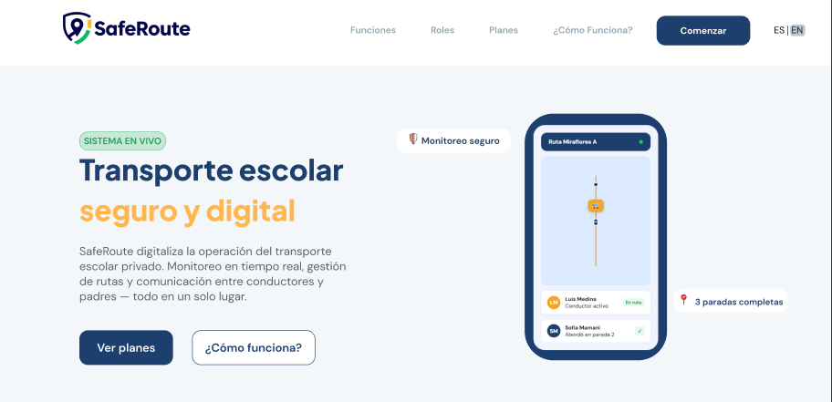

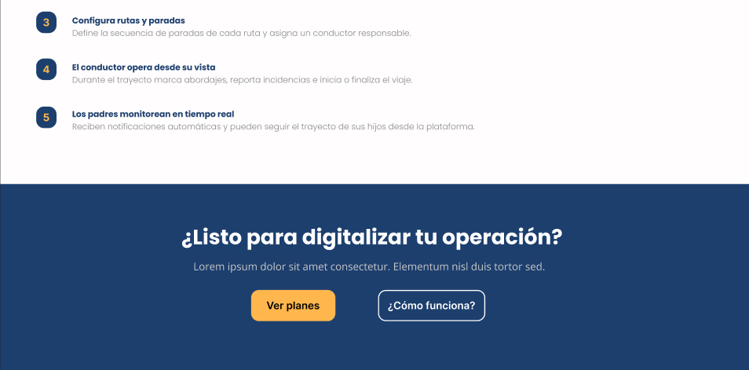

_Nota_: Elaboración propia.

## 4.2. Information Architecture

### 4.2.1. Organization Systems

En el sistema SafeRoute, se emplea la organización jerárquica (visual hierarchy) para destacar información crítica, como el mapa de monitoreo en tiempo real, las alertas de emergencia y las notificaciones de abordaje de los alumnos en los dashboards principales. Esta jerarquía visual permite que tanto padres como conductores identifiquen de forma inmediata los datos más relevantes según el contexto operativo, relegando datos secundarios del perfil a niveles inferiores.

Asimismo, se aplica una organización secuencial (step-by-step) en procesos que requieren una guía estructurada. En la landing page, este sistema se evidencia en la sección "¿Cómo funciona?", donde se orienta al visitante a través de 5 pasos para la adopción del servicio. En la Web Application, este esquema se utilizará para el flujo de registro de paradas y asistencia que el conductor debe seguir durante su ruta, asegurando una progresión lógica que minimice errores de registro.

Respecto a los esquemas de categorización, no se utilizan organizaciones alfabéticas o matriciales complejas. En su lugar, se emplea una organización cronológica para la visualización de datos históricos, permitiendo que los padres de familia revisen los registros pasados de asistencias y llegadas de sus hijos de manera ordenada por fecha y hora. Además, el contenido se clasifica según audiencia, segmentando las interfaces y funcionalidades de acuerdo con los dos User Personas identificados: Conductores, enfocados en la gestión de ruta y paradas, y Padres de Familia, orientados al monitoreo y recepción de avisos de seguridad.

### 4.2.2. Labeling Systems

El sistema de etiquetado de SafeRoute ha sido desarrollado bajo un criterio de funcionalidad operativa, buscando que cada término actúe como una señal clara que reduzca el esfuerzo cognitivo de los usuarios. Se han seleccionado etiquetas descriptivas que permiten una navegación intuitiva tanto en el proceso de descubrimiento (Landing Page) como en el uso crítico de la aplicación (Web Application).

**Landing Page**

  - **Funciones**: Agrupa las capacidades técnicas y herramientas de gestión de la plataforma.
  - **Roles**: Define los accesos y beneficios específicos para los dos perfiles del sistema.
  - **Planes**: Estructura la oferta comercial basándose en la escala de la flota de transporte.
  - **¿Cómo funciona?**: Etiqueta de apoyo que resuelve dudas sobre la implementación del servicio.
  - **Comenzar**: Botón de acción principal diseñado para motivar la conversión inmediata.

**Aplicación Web – Conductores**

  - **Mis Rutas**: Vista principal donde se gestionan los trayectos diarios asignados.
  - **Lista de Alumnos**: Relación detallada de estudiantes por paradas, optimizando el tiempo de recogida.
  - **Estado de Abordaje**: Sistema de etiquetas rápidas ("Abordado", "Ausente", "En espera") que permite al conductor registrar la asistencia con un solo toque.
  - **Iniciar Ruta**: Etiqueta de alta visibilidad que dispara el envío de alertas GPS a los padres.
  - **Botón de Incidencia**: Acceso directo para reportar eventos imprevistos (tráfico, accidentes) de forma estandarizada.

**Aplicación Web – Padres de Familia**

  - **Monitoreo**: Sección central que integra el mapa en tiempo real y la ubicación de la unidad.
  - **Historial de Viajes**: Registro cronológico de las horas de recogida y entrega de sus hijos.
  - **Alertas**: Centro de notificaciones sobre la proximidad del bus o confirmaciones de llegada.
  - **Datos del Bus**: Información transparente sobre el vehículo y el conductor asignado para generar confianza.

### 4.2.3. SEO Tags and Meta Tags

1. **Landing Page**

**Charset**

  `<meta charset="UTF-8" />`

Esta línea establece la codificación universal de caracteres. Su función es garantizar que el navegador interprete correctamente los textos del sistema i18n, asegurando que tildes, la letra "ñ" y símbolos especiales se visualicen sin errores en español e inglés, evitando una mala experiencia de lectura.

**Viewport (Responsive)**

  `<meta name="viewport" content="width=device-width, initial-scale=1.0"/>`

Controla el escalado de la página en diferentes dispositivos. Su función es hacer que la landing sea responsiva, ajustando el ancho del contenido al tamaño de la pantalla. Esto es vital para que los padres de familia visualicen la información de manera legible desde sus smartphones.

**Title (SEO)**
  
  `<title>SafeRoute — Transporte Escolar Seguro</title>`

Define el título que aparece en la pestaña del navegador y en los resultados de búsqueda. Su función es proporcionar una identificación inmediata de la marca y su propósito principal, siendo un factor crítico para el posicionamiento orgánico.

**Meta Description (SEO)**

  `<meta name="description" content="Plataforma integral para el monitoreo en tiempo real, control de asistencia y comunicación segura entre conductores y padres de familia.">`

Provee un resumen conciso del contenido del sitio. Su función es aparecer como el fragmento de texto (snippet) en Google, atrayendo a los usuarios al explicar claramente cómo SafeRoute resuelve la inseguridad en el transporte escolar.

**Meta Keywords (SEO)**

  `<meta name="keywords" content="transporte escolar, monitoreo GPS, seguridad, SafeRoute, logística escolar, app bilingüe">`

Especifica palabras clave relevantes para la temática de la página. Su función es ayudar a los algoritmos de indexación a clasificar el sitio dentro del nicho de tecnología de transporte y seguridad educativa.

**Meta Author**

  `<meta name="author" content="FiveTech Team">`
Identifica formalmente a los creadores de la plataforma. Su función es atribuir la autoría del proyecto al equipo de FiveTech, vinculando el desarrollo técnico con el startup responsable.

**Meta Copyright**

  `<meta name="copyright" content="FiveTech 2026">`

Esta línea establece legalmente la propiedad intelectual de la página. Su función es indicar la titularidad de los derechos de autor y el año de vigencia, protegiendo el contenido y diseño del sitio.

**Meta Robots**

  `<meta name="robots" content="index, follow">`

Instruye a los motores de búsqueda sobre cómo tratar el sitio. Su función es permitir que los "robots" incluyan la página en sus índices y sigan los enlaces internos, lo cual es fundamental para el crecimiento del tráfico hacia la plataforma.

**Meta Language**

  `<html lang="en">`

Declara el idioma principal de la estructura del sitio. Su función es informar a los navegadores y buscadores que el texto base está en ingles, mejorando la segmentación del público objetivo internacionalmente.

### 4.2.4. Searching Systems

En esta sección se describen los mecanismos de asistencia y recuperación de información diseñados para SafeRoute. El objetivo primordial es evitar la desorientación del usuario ante el flujo constante de datos logísticos, garantizando que la información sobre rutas y alumnos sea accesible de manera inmediata.

**Vista del Conductor / Dueño de Unidad**

**1. Medios de ayuda para la búsqueda de datos**

  - Barra de búsqueda operativa: Ubicada en los módulos de "Rutas" y "Lista de Alumnos" para acceso rápido.
  - Autocompletado inteligente: Sugiere nombres de alumnos o puntos de parada conforme el conductor escribe, facilitando la operación en dispositivos móviles.
  - Mensajes contextuales: En caso de no hallar un registro, el sistema ofrece opciones como "¿Desea registrar un nuevo alumno en esta parada?".
  - Búsqueda por proximidad: Sugerencia automática de la siguiente parada basada en la ubicación GPS actual.

**2. Filtros y opciones**

  - Por Nombre del Alumno: Localización directa de la ficha de contacto y datos de emergencia.
  - Por Estado de Asistencia: Filtrado rápido de alumnos "Abordados", "Pendientes" o "Ausentes".
  - Por Punto de Parada: Visualización de todos los estudiantes vinculados a un hito específico de la ruta.
  - Por Turno: Filtrado entre rutas de "Recojo" (mañana) y "Retorno" (tarde).

**3. Visualización de resultados**

  - Tarjetas de Alumno (Cards): Incluyen foto, nombre, grado y una etiqueta de estado de alta visibilidad.
  - Indicadores de Color:
      - Azul: Alumno en espera.
      - Verde: Alumno ya abordó la unidad.
      - Rojo: Alumno reportado como ausente.
  - Acciones rápidas: Botones directos para "Marcar Asistencia", "Llamar a Apoderado" o "Reportar Incidencia".

**Vista del Padre de Familia**

**1. Medios de ayuda para la búsqueda de datos**

  - Buscador de historial: Permite localizar eventos específicos dentro de la bitácora de viajes del alumno.
  - Sugerencias por fecha: Calendario interactivo para seleccionar días específicos de consulta.
  - Acceso directo a Unidad: Buscador para identificar los datos del bus asignado mediante la placa o nombre del conductor.

**2. Filtros y opciones**

  - Por Fecha: Consulta de registros de asistencia de días o meses anteriores.
  - Por Tipo de Evento: Filtrado entre "Notificaciones de Proximidad", "Confirmación de Abordaje" y "Llegada al Destino".
  - Por Estado del Viaje: Filtrado entre rutas "Completadas", "En curso" o "Canceladas".

**3. Visualización de resultados**

  - Timeline de Eventos: Lista cronológica detallada con la hora exacta de cada suceso.
  - Mapa de Resultados: Al buscar un historial, se muestra el trazado que siguió la unidad en esa fecha específica.
  - Colores de Estado:

      - Check Verde: Evento completado con éxito.

      - Reloj Naranja: Retraso reportado en el punto de entrega.

      - Círculo Gris: Registro de inasistencia justificada.

### 4.2.5. Navigation Systems

La navegación en SafeRoute ha sido diseñada para ser intuitiva y guiada mediante componentes de interfaz que permiten a los usuarios gestionar la seguridad del transporte de forma fluida y sin fricciones. En la landing page, se utiliza un sistema de desplazamiento vertical (smooth scroll) que permite explorar de forma narrativa los beneficios, los roles de usuario y los planes de suscripción, guiando al visitante estratégicamente hacia los llamados a la acción (CTAs) para el contacto. Esta navegación se apoya en una barra superior persistente (Sticky Nav) que incluye un selector de idioma (i18n), permitiendo cambiar el contexto lingüístico en cualquier punto del recorrido.

Dentro de la aplicación web, la navegación principal se organiza mediante una barra lateral fija (Sidebar) que otorga acceso inmediato a las secciones críticas: Monitoreo en Tiempo Real, Lista de Alumnos, Historial de Rutas, Alertas de Seguridad y Configuración de Perfil. Este diseño permite que, por ejemplo, un conductor pueda alternar entre su hoja de ruta y el reporte de incidencias con un solo toque, manteniendo siempre la visibilidad del estado del viaje.

La experiencia de navegación también se adapta dinámicamente según el tipo de usuario. Los Padres de Familia acceden a una vista simplificada centrada en el mapa y las notificaciones de sus hijos, mientras que los Conductores disponen de controles operativos más robustos. El uso de pestañas (tabs) y botones de acción rápida dentro de cada módulo asegura que el usuario pueda ejecutar tareas específicas, como marcar la asistencia o llamar a un apoderado, sin perder el contexto de la ruta activa, garantizando un flujo de trabajo coherente con la naturaleza crítica del servicio.

## 4.3. Landing Page UI Design

### 4.3.1. Landing Page Wireframe

A continuación, se presentan los wireframes de las principales secciones de la landing page. Cada imagen ilustra el diseño propuesto para las diferentes funcionalidades, flujos de navegación y elementos de interacción de la plataforma.

**Principios Aplicados**

- **Jerarquía visual clara:** Los contenidos se ordenan priorizando la información de confianza en el Hero Section (Seguridad y Gestión). Se guía al usuario progresivamente a través de las estadísticas de impacto, los beneficios específicos para padres y conductores, la tabla comparativa de planes y, finalmente, el tutorial operativo.

- **Consistencia visual:** Se mantuvieron patrones uniformes utilizando la tipografía Plus Jakarta Sans para títulos impactantes y DM Sans para la legibilidad del cuerpo. Se aplicó la paleta institucional (azul marino para seguridad y ámbar para alertas) de manera coherente en todos los componentes.

- **Contraste y accesibilidad:** Se garantizó un contraste elevado entre el texto y los fondos para facilitar la lectura en condiciones de luz exterior (común para conductores y padres en ruta). Los botones de acción cuentan con estados visuales claros para confirmar la interacción del usuario.

- **Optimización para dispositivos móviles:** Los wireframes y el diseño final contemplan una navegación móvil dedicada. Se implementó un menú lateral (sidebar) activado por un botón hamburguesa para ahorrar espacio, se ajustaron las cuadrículas (grids) a una sola columna para evitar el desplazamiento horizontal y se optimizaron las áreas de contacto en botones para una interacción táctil precisa.

- **Diseño inclusivo:** La estructura es totalmente compatible con el sistema i18n, permitiendo que el diseño se adapte dinámicamente al largo de las palabras en español e inglés. Además, se aseguró que la navegación sea lógica y accesible mediante teclado y lectores de pantalla, facilitando el uso para cualquier tipo de usuario.

##### Versión Desktop Web Browser:

En esta primera sección se presenta la pantalla Home de la landing page, donde se observa el encabezado principal con la propuesta de valor y el acceso al sistema de internacionalización (i18n). Se aprecia un botón call-to-action principal diseñado para captar el interés de los padres de familia y conductores independientes.

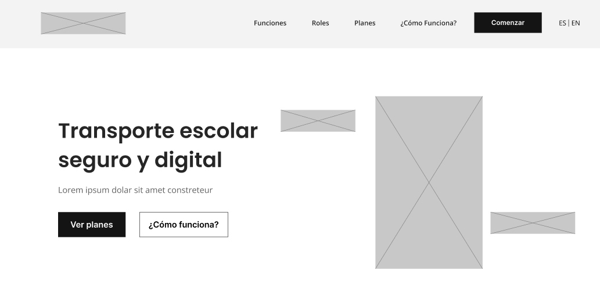

A continuación, se muestra la Sección de Características, donde se detallan los pilares de seguridad y eficiencia que sustentan la plataforma SafeRoute, utilizando iconos y textos breves para una lectura rápida.

Se presenta la sección de Funcionalidades, la cual profundiza en las capacidades tecnológicas del sistema, como el monitoreo en tiempo real y las notificaciones automáticas.

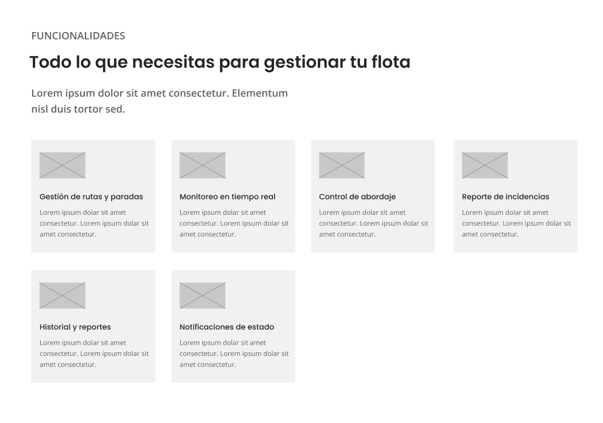

Los siguientes frames corresponden a los Roles del Sistema, donde se segmentan los beneficios específicos para cada usuario objetivo: los padres de familia, enfocados en la tranquilidad y el seguimiento, y los conductores, enfocados en la gestión operativa de la ruta.

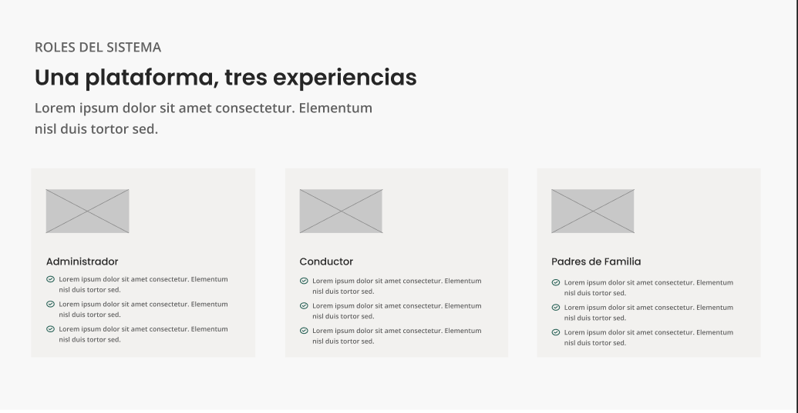

Se presenta la sección de Planes, donde se muestra la estructura de precios y niveles de servicio, diseñada de forma escaneable para facilitar la toma de decisiones comerciales.

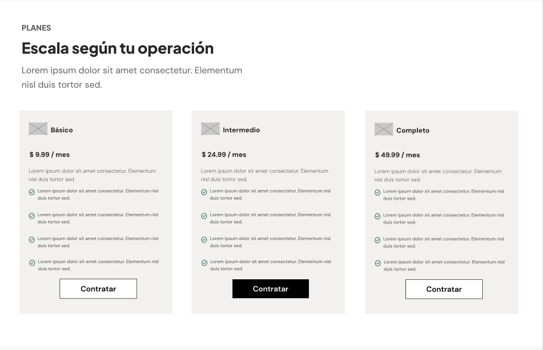

A continuación, se detalla el flujo de uso del sistema en la sección "¿Cómo funciona?". Este tutorial visual guía al nuevo usuario a través de los pasos necesarios para implementar la plataforma con éxito.

Finalmente, se presenta la sección de Contacto y Footer, la cual incluye el cierre de la página con los datos de comunicación directa y los créditos correspondientes al equipo de desarrollo de FiveTech.

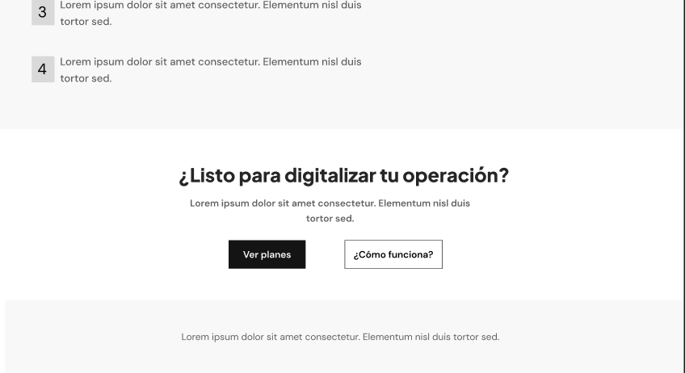

### 4.3.2. Landing Page Mock-up

A continuación, se presentan los mock-ups de las principales secciones de la landing page. Cada imagen ilustra el diseño propuesto para las diferentes funcionalidades, flujos de navegación y elementos de interacción de la plataforma.

En esta primera sección se presenta la pantalla Home de la landing page, donde se observa el encabezado principal con la propuesta de valor y el acceso al sistema de internacionalización (i18n). Se aprecia un botón call-to-action principal diseñado para captar el interés de los padres de familia y conductores independientes.

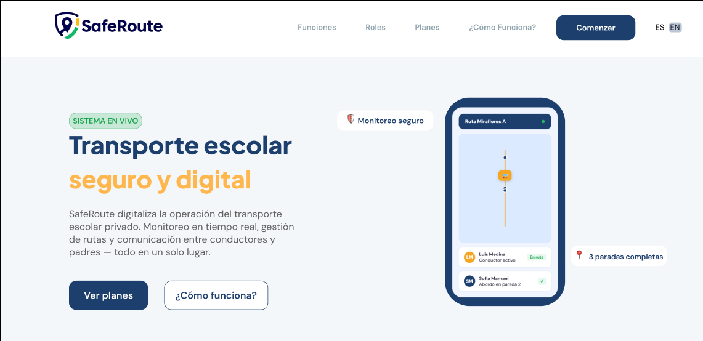

A continuación, se muestra la Sección de Características, donde se detallan los pilares de seguridad y eficiencia que sustentan la plataforma SafeRoute, utilizando iconos y textos breves para una lectura rápida.

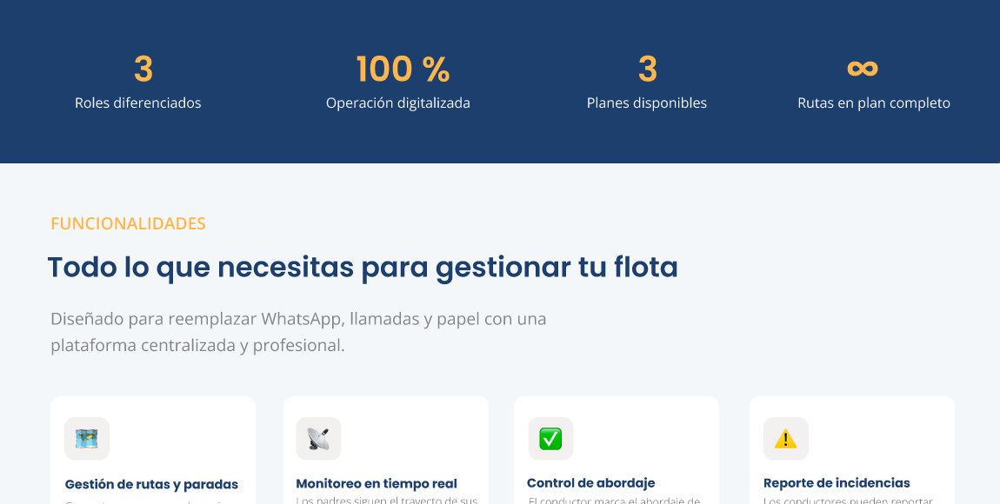

Se presenta la sección de Funcionalidades, la cual profundiza en las capacidades tecnológicas del sistema, como el monitoreo en tiempo real y las notificaciones automáticas.

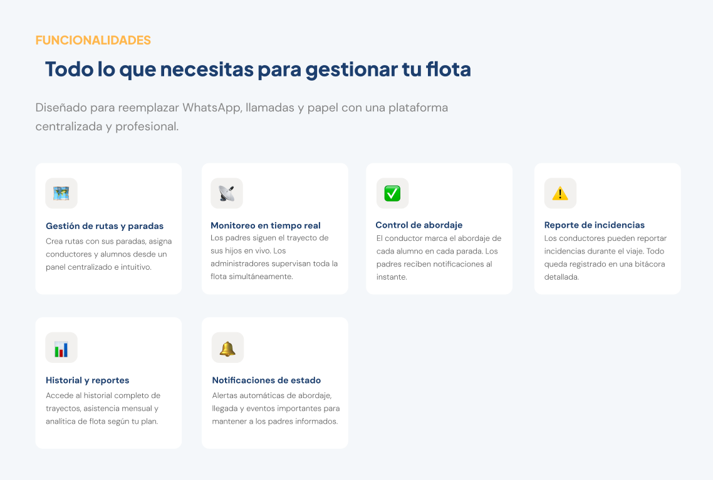

Los siguientes frames corresponden a los Roles del Sistema, donde se segmentan los beneficios específicos para cada usuario objetivo: los padres de familia, enfocados en la tranquilidad y el seguimiento, y los conductores, enfocados en la gestión operativa de la ruta.

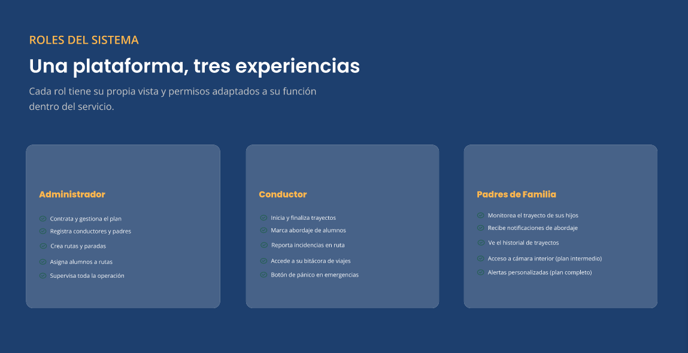

Se presenta la sección de Planes, donde se muestra la estructura de precios y niveles de servicio, diseñada de forma escaneable para facilitar la toma de decisiones comerciales.

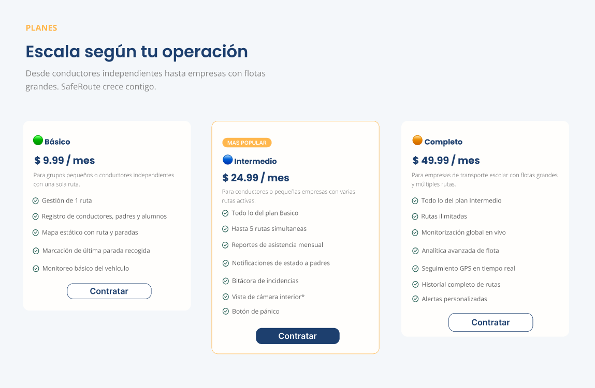

A continuación, se detalla el flujo de uso del sistema en la sección "¿Cómo funciona?". Este tutorial visual guía al nuevo usuario a través de los pasos necesarios para implementar la plataforma con éxito.

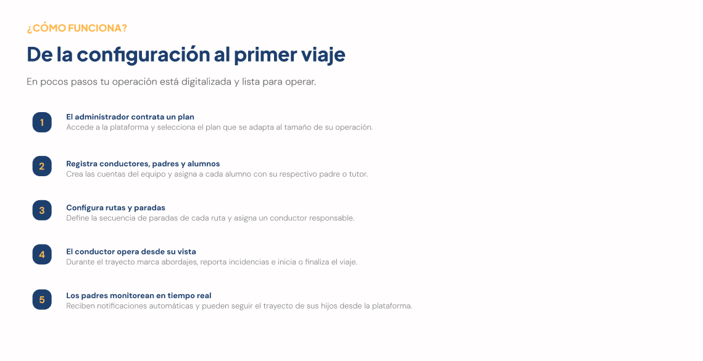

Finalmente, se presenta la sección de Contacto y Footer, la cual incluye el cierre de la página con los datos de comunicación directa y los créditos correspondientes al equipo de desarrollo de FiveTech.

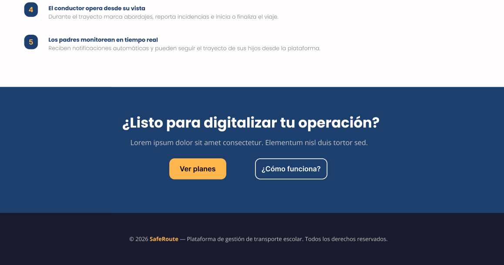

## 4.4. Web Applications UX/UI Design

### 4.4.1. Web Applications Wireframes

### 4.4.2. Web Applications Wireflow Diagrams

### 4.4.2. Web Applications Mock-ups

### 4.4.3. Web Applications User Flow Diagrams

## 4.5. Web Applications Prototyping

## 4.6. Domain-Driven Software Architecture

### 4.6.1. Design-Level Event Storming

### 4.6.2. Software Architecture Context Diagram

### 4.6.3. Software Architecture Container Diagrams

### 4.6.4. Software Architecture Components Diagrams

## 4.7. Software Object-Oriented Design

### 4.7.1. Class Diagrams

## 4.8. Database Design

### 4.8.1. Database Diagrams

---

## Capítulo V: Product Implementation, Validation & Deployment
### 5.1. Software Configuration Management
#### 5.1.1. Software Development Environment Configuration
#### 5.1.2. Source Code Management
#### 5.1.3. Source Code Style Guide & Conventions
#### 5.1.4. Software Deployment Configuration
### 5.2. Landing Page, Services & Applications Implementation
#### 5.2.X. Sprint n
##### 5.2.X.1. Sprint Planning n
##### 5.2.X.2. Aspect Leaders and Collaborators
##### 5.2.X.3. Sprint Backlog n
##### 5.2.X.4. Development Evidence for Sprint Review
##### 5.2.X.5. Execution Evidence for Sprint Review
##### 5.2.X.6. Services Documentation Evidence for Sprint Review
##### 5.2.X.7. Software Deployment Evidence for Sprint Review
##### 5.2.X.8. Team Collaboration Insights during Sprint

---

## Conclusiones
### Conclusiones y recomendaciones
### Video About-the-Team

## Bibliografía

## Anexos