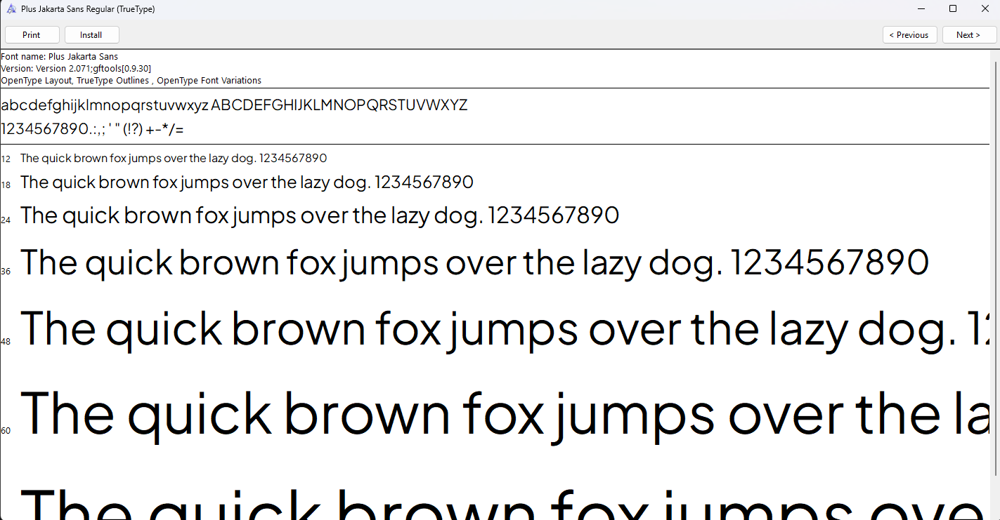
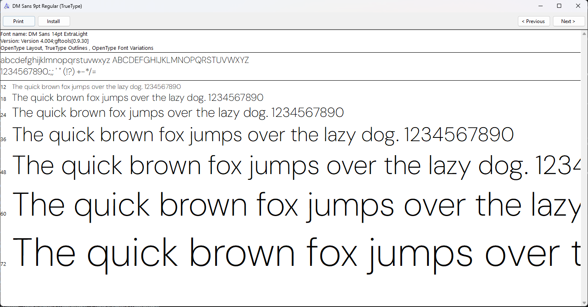

**Nombre de la Universidad:** Universidad Peruana de Ciencias Aplicadas  
**Facultad:** Ingeniería  
**Carrera:** Ingeniería de Software / Sistemas de Información  
**Ciclo:** 2026-10  

**Código del curso:** 1ASI0729  
**Nombre del curso:** Desarrollo de Aplicaciones Open Source  
**NRC:** 11896  
**Nombre del profesor:** Efraín Ricardo Bautista Ubillús  

**"Informe de Trabajo Final"** 
**Nombre del startup:** FiveTech  
**Nombre del producto:** SafeDrive  

**Relación de integrantes:**
* U201717085 - [Apellidos, Nombres]
* U202315968 - [Apellidos, Nombres]
* U202424059 - [Apellidos, Nombres]
* U202316852 -
* U20241D922 - Quispe Serrano, Julio Frank

**Abril, 2026**

---

## Registro de Versiones del Informe
| Avance | Fecha | Autor | Descripción de Modificación |
| :--- | :--- | :--- | :--- |
| AV1 | --/04/2026 | "-" | "-" |

---

## Project Report Collaboration Insights
El equipo ha utilizado un flujo de trabajo en github: [safedrive-report](https://github.com/FiveTech-NRC11896/safedrive-report)

---

## Contenido
1. [Student Outcome](#student-outcome)
2. [Capítulo I: Introducción](#capítulo-i-introducción)
3. [Capítulo II: Requirements Elicitation & Analysis](#capítulo-ii-requirements-elicitation--analysis)
4. [Capítulo III: Requirements Specification](#capítulo-iii-requirements-specification)
5. [Capítulo IV: Product Design](#capítulo-iv-product-design)
6. [Capítulo V: Product Implementation, Validation & Deployment](#capítulo-v-product-implementation-validation--deployment)
7. [Conclusiones](#conclusiones)
8. [Bibliografía](#bibliografía)
---

## Student Outcome
**ABET - EAC - Student Outcome 3:** Capacidad de comunicarse efectivamente con un rango de audiencias.

---

## Capítulo I: Introducción
### 1.1. Startup Profile
#### 1.1.1. Descripción de la Startup
#### 1.1.2. Perfiles de integrantes del equipo
### 1.2. Solution Profile
#### 1.2.1 Antecedentes y problemática
#### 1.2.2 Lean UX Process
##### 1.2.2.1. Lean UX Problem Statements
##### 1.2.2.2. Lean UX Assumptions
##### 1.2.2.3. Lean UX Hypothesis Statements
##### 1.2.2.4. Lean UX Canvas
### 1.3. Segmentos objetivo

---

## Capítulo II: Requirements Elicitation & Analysis
### 2.1. Competidores
#### 2.1.1. Análisis competitivo
#### 2.1.2. Estrategias y tácticas frente a competidores
### 2.2. Entrevistas
#### 2.2.1. Diseño de entrevistas
#### 2.2.2. Registro de entrevistas
#### 2.2.3. Análisis de entrevistas
### 2.3. Needfinding
#### 2.3.1. User Personas
#### 2.3.2. User Task Matrix
#### 2.3.3. User Journey Mapping
#### 2.3.4. Empathy Mapping
### 2.4. Big Picture Event Storming
### 2.5. Ubiquitous Language

---

## Capítulo III: Requirements Specification
### 3.1. User Stories
### 3.2. Impact Mapping
### 3.3. Product Backlog

---

## Capítulo IV: Product Design

## 4.1. Style Guidelines

#### 4.1.1. General Style Guidelines

El diseño de SafeRoute se fundamenta en decisiones visuales estratégicas destinadas a proyectar seguridad, fiabilidad y modernidad. El objetivo principal es construir una experiencia de usuario que genere confianza inmediata, tanto en los padres de familia que buscan tranquilidad como en los transportistas que necesitan eficiencia.

#### Colores
La selección cromática de SafeRoute no es meramente estética; responde a una psicología del color aplicada a la seguridad y el entorno escolar, garantizando accesibilidad y jerarquía visual. Cada tono desempeña una función específica en la interfaz:

- Azul Noche Profundo - #1A1A2E: Este color transmite autoridad, seriedad máxima y seguridad corporativa. En SafeRoute, se utiliza estratégicamente en el texto principal del logotipo y como fondo en secciones críticas de cierre, como el CTA final y el footer, para anclar la percepción de una plataforma robusta y confiable.

- Azul Marino - #1D3F6E y #16305a:Esta gama de azules medios y oscuros refuerza la percepción de una herramienta tecnológica, profesional y estable. Se emplean principalmente en títulos secundarios y elementos estructurales clave, estableciendo la jerarquía visual y la formalidad que el servicio requiere.

- Naranja Ámbar - #FFB74D: Este color funciona como el punto focal de acento y acción principal en SafeRoute, aportando vitalidad, energía y una conexión visual amigable con el entorno escolar. Se reserva exclusivamente para incentivar la acción en los botones de llamado a la acción principales y elementos destacados.

- Verde Éxito - #22C55E: Este color se asocia directamente con estados positivos, confirmación y seguridad. Se emplea de forma sutil en indicadores de estado (como el check en el mockup del teléfono) para validar acciones exitosas y reforzar la tranquilidad del usuario.

- Gris Neutro - #6B7280: Se ha seleccionado para el texto de cuerpo y párrafos largos. Ofrece una legibilidad excelente sobre fondos claros, reduciendo la fatiga visual y aportando un acabado limpio y moderno.

- Gris Claro y Neutral - #F8F9FB y #F4F7FA: Estos tonos muy claros se utilizan como fondos alternos para delimitar secciones (como el Hero, Planes o ¿Cómo funciona?). Su función es estructurar la página, proporcionando descansos visuales y una sensación de limpieza tecnológica y amplitud.

#### Tipografía

Se seleccionó la tipografía “Plus Jakarta Sans” como fuente principal para los títulos de la plataforma de SafeRoute por su estilo geométrico moderno y su capacidad para captar la atención del usuario con un toque tecnológico pero amigable. Se utiliza en pesos altos para asegurar que los encabezados sean visualmente impactantes, sólidos y de fácil lectura.

Asimismo, optamos por la tipografía “DM Sans” como fuente secundaria para los textos de cuerpo y navegación por su diseño extremadamente legible, limpio y neutro. Su apariencia estética y claridad garantizan una experiencia de uso accesible y agradable, reduciendo la fatiga visual del usuario al leer información detallada sobre funciones o planes.

En cuanto al tamaño, se utiliza jerárquicamente en toda la página para resaltar títulos principales, botones de acción y texto de soporte. Los tamaños más grandes en los encabezados guían al usuario rápidamente por los puntos clave del mensaje, mientras que los más pequeños en los párrafos aseguran la comprensión y la eficiencia en la lectura de detalles secundarios.

#### Branding

El branding de SafeRoute está diseñado para reflejar simplicidad, confianza y profesionalismo. El logo y los íconos adoptan un enfoque minimalista, con líneas claras y formas simples que comunican el propósito de seguridad de la plataforma. El diseño incluye un símbolo que combina un escudo y un marcador de posición, representado de tal manera que simboliza protección y monitoreo con una apariencia limpia que es fácilmente reconocible, tanto en entornos web como móviles.

#### Espaciado

El diseño de SafeRoute utiliza una estrategia de espacios en blanco diseñada para transmitir orden y claridad, factores críticos en una herramienta de seguridad escolar. En lugar de saturar la vista, aprovechamos márgenes amplios en los laterales de cada sección para que el usuario pueda diferenciar rápidamente entre los beneficios para padres, conductores y colegios. El contenido se mantiene estructurado mediante el uso de Flexbox y CSS Grid, lo que evita que la información se disperse y mantiene una jerarquía visual equilibrada que facilita la lectura de las características del servicio. Además, los rellenos (padding) en elementos como las tarjetas de planes y funciones garantizan una distribución adecuada del contenido.

#### Dimensiones para el tono de comunicación y lenguaje aplicado

En SafeRoute, definimos cuidadosamente el tono de nuestra comunicación para alinearlo con la misión de la plataforma: garantizar la seguridad y la tranquilidad en el transporte escolar para padres, conductores e instituciones educativas. Nuestro tono de voz busca proyectar confianza y control, combinando una comunicación clara, directa y altamente profesional.

Optamos por un tono formal pero empático, que permita a los padres de familia sentirse seguros al interactuar con funciones críticas como el monitoreo en vivo o las notificaciones de abordaje. Queremos que cada interacción refleje eficiencia para fomentar la puntualidad y el orden, pero también serenidad, asegurando que los usuarios sientan que el bienestar de los estudiantes es nuestra prioridad absoluta. Este equilibrio nos permite inspirar autoridad en la gestión logística, al tiempo que proyectamos cercanía y compromiso con la comunidad escolar.

Además, se han considerado los siguientes aspectos clave en el diseño de SafeRoute:

- Consistencia: La coherencia visual y textual es fundamental para brindar una experiencia confiable. Todos los elementos, desde los mensajes de estado hasta las etiquetas de los botones, mantienen una línea comunicativa uniforme. Esto facilita que los usuarios se familiaricen rápido con el sistema, algo vital en una operación diaria que requiere precisión.
- Navegación: La estructura ha sido pensada para ser lógica y sin fricciones. Los usuarios pueden acceder rápidamente a la información relevante según su rol, ya sea para verificar una ruta o reportar una incidencia. Los menús son minimalistas para evitar confusiones y optimizar el tiempo de respuesta en entornos dinámicos.
- Accesibilidad: La plataforma está optimizada para ser inclusiva y funcional en diversos contextos. Mediante el uso de etiquetas claras y un diseño responsivo, aseguramos que la información sea legible tanto para un administrador en una oficina como para un padre que revisa el celular en movimiento, garantizando una experiencia de uso fluida para todos.

#### Elementos de diseño

Además de los lineamientos generales sobre colores, tipografía y branding, en el diseño visual de SafeRoute se han aplicado de manera consciente diversos elementos fundamentales del diseño gráfico que enriquecen la experiencia del usuario y refuerzan la identidad de seguridad de la plataforma.

Uno de los elementos clave es la **línea**, utilizada sutilmente para separar secciones y delimitar las tarjetas de planes y roles, lo que organiza visualmente la interfaz y guía la lectura sin saturar al usuario. El **color** cumple un rol fundamental no solo en la identidad, sino en la comunicación funcional; la paleta incluye el azul noche para la autoridad, el naranja ámbar para la acción y el verde para confirmaciones, seleccionados por su capacidad para transmitir estados de seguridad y éxito.

En cuanto al **tamaño**, se utiliza jerárquicamente para resaltar títulos, botones y texto de soporte. Los tamaños más grandes en los encabezados captan la atención en puntos clave como el Hero, mientras que los más pequeños se emplean para detalles secundarios en las tarjetas de características, mejorando la comprensión y la eficiencia. Por su parte, la **textura** es limpia y moderna, gracias al uso de fondos suaves y superficies blancas que aportan una sensación de amplitud tecnológica sin distraer de las funciones de monitoreo.

El **espacio** es uno de los elementos más destacados del diseño de SafeRoute. Se han implementado márgenes amplios y rellenos generosos entre secciones, lo que permite una interfaz despejada y cómoda para padres y conductores. A nivel de **brillo** (value), se aplican contrastes claros que diferencian los botones de acción del fondo, guiando al usuario de forma intuitiva hacia la conversión.

Respecto a las **formas**, se ha optado por geometrías amigables con bordes redondeados en botones y tarjetas. Estos acabados suavizados no solo mejoran la estética profesional, sino que también transmiten una imagen de accesibilidad y cercanía, alineándose con una herramienta diseñada para el cuidado y protección escolar.

#### Principios de diseño

En cuanto a los principios de diseño, el **contraste** se emplea para asegurar que los elementos críticos, como los llamados a la acción (CTA) de "Ver planes" o las etiquetas de "Sistema en vivo", sean claramente visibles y resalten sobre los fondos neutros. Este principio es fundamental para la accesibilidad visual, permitiendo que tanto padres como conductores identifiquen los puntos de interacción más importantes de la plataforma de manera inmediata.

La **repetición** de colores como el azul noche y el naranja ámbar, junto con una iconografía coherente de escudos y mapas, refuerza la familiaridad y la consistencia del sistema visual. Al utilizar componentes visuales recurrentes en toda la landing, los usuarios comprenden rápidamente la función de cada sección, lo que reduce la curva de aprendizaje al interactuar con las herramientas de monitoreo.

La **alineación** contribuye a la profesionalidad y solidez del diseño: la estructura de la página, los listados de roles y las tarjetas de precios mantienen una disposición coherente lograda mediante el uso de Flexbox y CSS Grid. Esta organización clara y alineada facilita una navegación intuitiva, transmitiendo el orden necesario para una plataforma de gestión logística.

Por último, el principio de **proximidad** agrupa de manera lógica los elementos relacionados, como los iconos de las funciones con sus respectivas descripciones o los beneficios específicos para cada rol. Al mantener los elementos vinculados cerca entre sí, se mejora significativamente la lectura y la comprensión de cada bloque de información, permitiendo que el usuario asocie rápidamente las soluciones de SafeRoute con sus necesidades específicas.

Estos elementos y principios no se aplican de forma aislada, sino como parte integral de un sistema visual que busca ser funcional, estético y coherente con la misión de SafeRoute: digitalizar y dar seguridad al transporte escolar a través de una experiencia clara, confiable y eficiente.

#### 4.1.2. Web Style Guidelines

El diseño web de SafeRoute está optimizado para proporcionar una experiencia de usuario fluida y profesional, centrada en la legibilidad y la facilidad de navegación. Se emplean estructuras de contenedores flexibles que permiten que el contenido se organice de manera clara, utilizando amplios espacios en blanco para evitar la saturación visual y garantizar la accesibilidad de la información crítica sobre seguridad. Los elementos visuales, como tarjetas de planes y secciones de roles, mantienen proporciones equilibradas para guiar la vista del usuario de forma jerárquica.

En cuanto a la interactividad, la plataforma utiliza una lógica de componentes claramente identificables. Los botones de acción (CTAs) emplean colores contrastantes y estados visuales (como hover y active) que ofrecen una retroalimentación inmediata, reforzando la confianza del usuario al interactuar con el sistema. La navegación se apoya en transiciones suaves y menús persistentes que aseguran que las herramientas principales, como el sistema de internacionalización (i18n), estén siempre al alcance del usuario, facilitando un flujo de trabajo intuitivo y eficiente dentro de la landing page.

## 4.2. Information Architecture

#### 4.2.1. Organization Systems

#### 4.2.2. Labeling Systems

#### 4.2.3. SEO Tags and Meta Tags

#### 4.2.4. Searching Systems

#### 4.2.5. Navigation Systems

## 4.3. Landing Page UI Design

#### 4.3.1. Landing Page Wireframe

#### 4.3.2. Landing Page Mock-up

## 4.4. Web Applications UX/UI Design

#### 4.4.1. Web Applications Wireframes

#### 4.4.2. Web Applications Wireflow Diagrams

#### 4.4.2. Web Applications Mock-ups

#### 4.4.3. Web Applications User Flow Diagrams

## 4.5. Web Applications Prototyping

## 4.6. Domain-Driven Software Architecture

#### 4.6.1. Design-Level Event Storming

#### 4.6.2. Software Architecture Context Diagram

#### 4.6.3. Software Architecture Container Diagrams

#### 4.6.4. Software Architecture Components Diagrams

## 4.7. Software Object-Oriented Design

#### 4.7.1. Class Diagrams

## 4.8. Database Design

#### 4.8.1. Database Diagrams

---

## Capítulo V: Product Implementation, Validation & Deployment
### 5.1. Software Configuration Management
#### 5.1.1. Software Development Environment Configuration
#### 5.1.2. Source Code Management
#### 5.1.3. Source Code Style Guide & Conventions
#### 5.1.4. Software Deployment Configuration
### 5.2. Landing Page, Services & Applications Implementation
#### 5.2.X. Sprint n
##### 5.2.X.1. Sprint Planning n
##### 5.2.X.2. Aspect Leaders and Collaborators
##### 5.2.X.3. Sprint Backlog n
##### 5.2.X.4. Development Evidence for Sprint Review
##### 5.2.X.5. Execution Evidence for Sprint Review
##### 5.2.X.6. Services Documentation Evidence for Sprint Review
##### 5.2.X.7. Software Deployment Evidence for Sprint Review
##### 5.2.X.8. Team Collaboration Insights during Sprint

---

## Conclusiones
### Conclusiones y recomendaciones
### Video About-the-Team

## Bibliografía

## Anexos